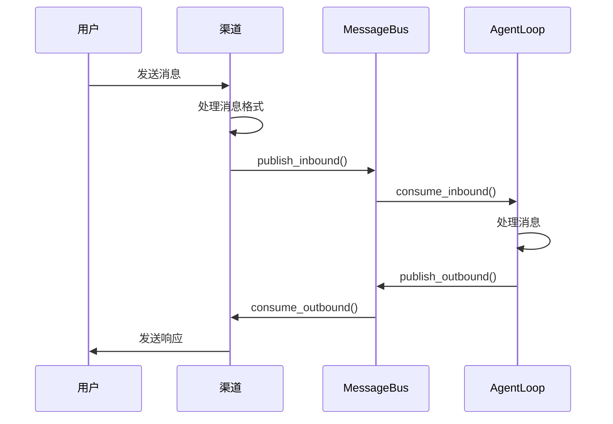

# Channel API 文档

> **渠道系统 API 参考** - 详细介绍渠道基类、渠道管理器和各平台适配器的使用方法

---

## 📑 目录

1. [BaseChannel 基类](#basechannel-基类)
2. [ChannelManager 管理器](#channelmanager-管理器)
3. [内置渠道](#内置渠道)
4. [自定义渠道](#自定义渠道)
5. [消息传递](#消息传递)
6. [权限管理](#权限管理)
7. [错误处理](#错误处理)
8. [使用示例](#使用示例)

---

## BaseChannel 基类

`BaseChannel` 是所有渠道的抽象基类，定义了渠道的标准接口。

### 类定义

```python
from abc import ABC, abstractmethod
from typing import Any
from nanobot.bus.events import InboundMessage, OutboundMessage
from nanobot.bus.queue import MessageBus

class BaseChannel(ABC):
    """所有渠道的抽象基类"""

    name: str = "base"

    def __init__(
        self,
        config: Any,
        bus: MessageBus
    ):
        self.config = config
        self.bus = bus
        self._running = False

    @abstractmethod
    async def start(self) -> None:
        """启动渠道（连接平台）"""
        pass

    @abstractmethod
    async def send(self, msg: OutboundMessage) -> None:
        """发送消息到平台"""
        pass

    async def _handle_message(
        self,
        sender_id: str,
        chat_id: str,
        content: str,
        media: list[str] | None = None,
        metadata: dict | None = None,
    ) -> None:
        """处理接收的消息（统一入口）"""
        pass

    def is_allowed(self, user_id: str) -> bool:
        """检查用户是否有权限"""
        pass
```

### 核心属性

#### name
渠道的唯一标识符。

```python
class TelegramChannel(BaseChannel):
    name = "telegram"
```

#### config
渠道配置对象。

```python
@dataclass
class TelegramConfig:
    enabled: bool = True
    token: str = ""
    allow_from: list[str] = field(default_factory=list)
    parse_mode: str = "Markdown"
```

#### _running
渠道运行状态。

```python
@property
def is_running(self) -> bool:
    return self._running
```

### 核心方法

#### start()

```python
@abstractmethod
async def start(self) -> None:
    """启动渠道（连接平台）

    实现：
    1. 连接到平台
    2. 设置消息处理器
    3. 开始监听消息
    4. 设置 _running = True
    """
```

#### send()

```python
@abstractmethod
async def send(self, msg: OutboundMessage) -> None:
    """发送消息到平台

    参数:
        msg: 要发送的消息对象

    实现：
    1. 处理消息格式（分片、转义等）
    2. 调用平台 API 发送消息
    3. 处理发送结果
    """
```

#### _handle_message()

```python
async def _handle_message(
    self,
    sender_id: str,
    chat_id: str,
    content: str,
    media: list[str] | None = None,
    metadata: dict | None = None,
) -> None:
    """处理接收的消息（统一入口）

    1. 权限检查
    2. 创建 InboundMessage
    3. 发布到消息总线
    """
```

#### is_allowed()

```python
def is_allowed(self, user_id: str) -> bool:
    """检查用户是否有权限"""
    allow_list = self.config.allow_from

    # 空列表 = 拒绝所有
    if not allow_list:
        return False

    # "*" = 允许所有
    if "*" in allow_list:
        return True

    # 检查用户是否在列表中
    return user_id in allow_list
```

---

## ChannelManager 管理器

`ChannelManager` 负责渠道的注册、启动和管理。

### 类定义

```python
from typing import Dict, Type, Any
from nanobot.config.schema import ChannelsConfig

class ChannelManager:
    """渠道管理器"""

    def __init__(self, config: ChannelsConfig, bus: MessageBus):
        self.config = config
        self.bus = bus
        self._channels: dict[str, BaseChannel] = {}
        self._channel_classes: dict[str, Type[BaseChannel]] = {}

    def register(self, name: str, channel_class: Type[BaseChannel]) -> None:
        """注册渠道类"""
        pass

    async def start_all(self) -> None:
        """启动所有启用的渠道"""
        pass

    async def stop_all(self) -> None:
        """停止所有渠道"""
        pass

    async def get_channel(self, name: str) -> BaseChannel:
        """获取渠道实例"""
        pass

    def list_channels(self) -> list[str]:
        """列出所有渠道"""
        pass
```

### 方法详解

#### register()

```python
def register(self, name: str, channel_class: Type[BaseChannel]) -> None:
    """注册渠道类

    参数:
        name: 渠道名称
        channel_class: 渠道类（必须继承 BaseChannel）

    示例:
        manager.register("telegram", TelegramChannel)
        manager.register("discord", DiscordChannel)
    """
    self._channel_classes[name] = channel_class
    logger.info(f"Registered channel class: {name}")
```

#### start_all()

```python
async def start_all(self) -> None:
    """启动所有启用的渠道

    流程：
    1. 遍历配置中的渠道
    2. 如果渠道启用，创建实例并启动
    3. 等待所有渠道启动完成
    """
    tasks = []

    for name, channel_config in self.config.channels.items():
        if not channel_config.enabled:
            logger.info(f"Skipping disabled channel: {name}")
            continue

        if name not in self._channel_classes:
            logger.error(f"Unknown channel: {name}")
            continue

        # 创建渠道实例
        channel_class = self._channel_classes[name]
        channel = channel_class(channel_config, self.bus)

        # 启动渠道
        task = asyncio.create_task(channel.start())
        tasks.append((name, task, channel))

    # 等待所有渠道启动
    for name, task, channel in tasks:
        try:
            await task
            self._channels[name] = channel
            logger.info(f"Channel '{name}' started successfully")
        except Exception as e:
            logger.error(f"Failed to start channel '{name}': {e}")
```

#### stop_all()

```python
async def stop_all(self) -> None:
    """停止所有渠道"""
    for name, channel in self._channels.items():
        try:
            # 假设渠道有 stop 方法
            if hasattr(channel, 'stop'):
                await channel.stop()
            channel._running = False
            logger.info(f"Channel '{name}' stopped")
        except Exception as e:
            logger.error(f"Error stopping channel '{name}': {e}")

    self._channels.clear()
```

---

## 内置渠道

### 1. Telegram 渠道

#### TelegramChannel 类

```python
class TelegramChannel(BaseChannel):
    """Telegram 机器人渠道"""

    name = "telegram"

    def __init__(
        self,
        config: TelegramConfig,
        bus: MessageBus
    ):
        super().__init__(config, bus)
        self.application = (
            Application.builder()
            .token(config.token)
            .build()
        )
        self.bot = self.application.bot

    async def start(self) -> None:
        """启动 Telegram 机器人"""
        # 设置消息处理器
        self.application.add_handler(
            MessageHandler(
                filters.ALL,
                self._on_message,
            )
        )

        # 启动机器人
        await self.application.initialize()
        await self.application.start()
        await self.application.updater.start_polling()

        self._running = True
        logger.info("Telegram channel started")

    async def send(self, msg: OutboundMessage) -> None:
        """发送消息到 Telegram"""
        # 处理长消息分片
        chunks = self._split_text(msg.content, 4096)

        for chunk in chunks:
            await self.bot.send_message(
                chat_id=msg.chat_id,
                text=chunk,
                parse_mode=self.config.parse_mode,
                reply_to_message_id=msg.reply_to,
            )

    async def _on_message(
        self,
        update: Update,
        context: ContextTypes.DEFAULT_TYPE
    ) -> None:
        """处理接收的消息"""
        message = update.effective_message
        user = update.effective_user

        # 下载媒体文件
        media = []
        if message.photo:
            photo = message.photo[-1]  # 获取最高质量的照片
            file = await photo.get_file()
            file_path = await self._download_file(file.file_path)
            media.append(file_path)

        # 处理文本内容
        content = message.text or message.caption or ""

        # 发送到消息总线
        await self._handle_message(
            sender_id=str(user.id),
            chat_id=str(message.chat_id),
            content=content,
            media=media,
        )
```

#### 配置示例

```python
from pydantic import BaseSettings

class TelegramConfig(BaseSettings):
    enabled: bool = True
    token: str = ""
    allow_from: list[str] = ["*"]  # 允许所有用户
    parse_mode: str = "Markdown"
    webhook_url: str = ""

class ChannelsConfig(BaseSettings):
    telegram: TelegramConfig = TelegramConfig()

# 使用配置
config = ChannelsConfig()
config.telegram.token = "123456:ABC-DEF..."
config.telegram.allow_from = ["123456789", "987654321"]  # 只允许特定用户
```

### 2. Discord 渠道

#### DiscordChannel 类

```python
class DiscordChannel(BaseChannel):
    """Discord 机器人渠道"""

    name = "discord"

    def __init__(
        self,
        config: DiscordConfig,
        bus: MessageBus
    ):
        super().__init__(config, bus)
        self.intents = discord.Intents.default()
        self.intents.messages = True
        self.intents.message_content = True
        self.client = discord.Client(intents=self.intents)

    async def start(self) -> None:
        """启动 Discord 机器人"""
        # 注册事件处理器
        self.client.event(self._on_message)
        self.client.event(self._on_ready)

        # 启动机器人
        await self.client.login(self.config.token)
        await self.client.connect()

        self._running = True
        logger.info("Discord channel started")

    async def send(self, msg: OutboundMessage) -> None:
        """发送消息到 Discord"""
        # 获取频道对象
        channel = self.client.get_channel(int(msg.chat_id))
        if not channel:
            raise ChannelError(f"Channel not found: {msg.chat_id}")

        # 发送消息
        await channel.send(
            content=msg.content,
            reference=msg.reply_to,
        )

    async def _on_message(self, message: discord.Message):
        """处理接收的消息"""
        if message.author == self.client.user:
            return  # 忽略机器人自己的消息

        # 发送到消息总线
        await self._handle_message(
            sender_id=str(message.author.id),
            chat_id=str(message.channel.id),
            content=message.content,
        )

    async def _on_ready(self):
        """机器人准备就绪"""
        logger.info(f"Discord bot connected as {self.client.user}")
```

### 3. WhatsApp 渠道

#### WhatsAppChannel 类

```python
class WhatsAppChannel(BaseChannel):
    """WhatsApp 渠道（通过桥接服务）"""

    name = "whatsapp"

    def __init__(
        self,
        config: WhatsAppConfig,
        bus: MessageBus
    ):
        super().__init__(config, bus)
        self.websocket_url = config.websocket_url
        self.session_id = config.session_id
        self.ws = None

    async def start(self) -> None:
        """启动 WhatsApp 连接"""
        self.ws = await websockets.connect(self.websocket_url)

        # 发送认证消息
        await self.ws.send(json.dumps({
            "type": "auth",
            "session_id": self.session_id,
        }))

        # 启动消息监听
        asyncio.create_task(self._listen_messages())

        self._running = True
        logger.info("WhatsApp channel started")

    async def send(self, msg: OutboundMessage) -> None:
        """发送 WhatsApp 消息"""
        await self.ws.send(json.dumps({
            "type": "send_message",
            "to": msg.chat_id,
            "content": msg.content,
        }))

    async def _listen_messages(self):
        """监听 WebSocket 消息"""
        async for message in self.ws:
            data = json.loads(message)

            if data["type"] == "message":
                await self._handle_message(
                    sender_id=data["from"],
                    chat_id=data["to"],
                    content=data["content"],
                )
```

---

## 自定义渠道

### 创建简单渠道

```python
class EchoChannel(BaseChannel):
    """回声渠道（测试用）"""

    name = "echo"

    async def start(self) -> None:
        """启动回声渠道"""
        self._running = True
        logger.info("Echo channel started")

    async def send(self, msg: OutboundMessage) -> None:
        """发送消息（回声）"""
        print(f"Echo: {msg.content}")
        # 这里可以添加实际的发送逻辑

    async def _handle_message(
        self,
        sender_id: str,
        chat_id: str,
        content: str,
        media: list[str] | None = None,
    ) -> None:
        """处理接收的消息"""
        # 直接回显消息
        await self.send(OutboundMessage(
            channel=self.name,
            chat_id=chat_id,
            content=f"Echo: {content}",
        ))
```

### 创建邮件渠道

```python
import aiosmtplib
from email.message import EmailMessage

class EmailChannel(BaseChannel):
    """邮件渠道"""

    name = "email"

    def __init__(
        self,
        config: EmailConfig,
        bus: MessageBus
    ):
        super().__init__(config, bus)
        self.smtp_host = config.smtp_host
        self.smtp_port = config.smtp_port
        self.username = config.username
        self.password = config.password
        self.imap_host = config.imap_host
        self.imap_port = config.imap_port

    async def start(self) -> None:
        """启动邮件监听"""
        self._running = True

        # 启动 IMAP 监听
        asyncio.create_task(self._listen_emails())

        logger.info("Email channel started")

    async def send(self, msg: OutboundMessage) -> None:
        """发送邮件"""
        # 创建邮件
        email = EmailMessage()
        email['From'] = self.username
        email['To'] = msg.chat_id
        email['Subject'] = "Nanobot Reply"
        email.set_content(msg.content)

        # 发送邮件
        await aiosmtplib.send(
            email,
            hostname=self.smtp_host,
            port=self.smtp_port,
            username=self.username,
            password=self.password,
        )

    async def _listen_emails(self):
        """监听新邮件"""
        while self._running:
            try:
                # 连接到 IMAP 服务器
                with imaplib.IMAP4_SSL(self.imap_host, self.imap_port) as imap:
                    imap.login(self.username, self.password)
                    imap.select('INBOX')

                    # 搜索未读邮件
                    status, messages = imap.search(None, 'UNSEEN')
                    if status == 'OK':
                        for msg_id in messages[0].split():
                            # 获取邮件
                            status, msg_data = imap.fetch(msg_id, '(RFC822)')
                            if status == 'OK':
                                email_data = msg_data[0][1]
                                email = email.message_from_bytes(email_data)

                                # 提取内容
                                content = email.get_payload(decode=True).decode()
                                sender = email['From']

                                # 发送到消息总线
                                await self._handle_message(
                                    sender_id=sender,
                                    chat_id=sender,
                                    content=content,
                                )

                                # 标记为已读
                                imap.store(msg_id, '+FLAGS', '\\Seen')

                    # 等待一段时间
                    await asyncio.sleep(60)

            except Exception as e:
                logger.error(f"Email listening error: {e}")
                await asyncio.sleep(60)
```

### 创建 Webhook 渠道

```python
from fastapi import FastAPI, Request, Response
from fastapi.responses import JSONResponse

class WebhookChannel(BaseChannel):
    """Webhook 渠道"""

    name = "webhook"

    def __init__(
        self,
        config: WebhookConfig,
        bus: MessageBus
    ):
        super().__init__(config, bus)
        self.app = FastAPI()
        self.port = config.port
        self.secret = config.secret

        # 设置路由
        self.app.post("/webhook")(self._handle_webhook)

    async def start(self) -> None:
        """启动 webhook 服务器"""
        import uvicorn

        self._running = True
        logger.info(f"Webhook server started on port {self.port}")

        # 启动服务器
        config = uvicorn.Config(
            self.app,
            host="0.0.0.0",
            port=self.port,
            log_level="info"
        )
        server = uvicorn.Server(config)
        await server.serve()

    async def send(self, msg: OutboundMessage) -> None:
        """发送消息（这里不适用，webhook 是接收方）"""
        logger.warning("Send not implemented for webhook channel")

    async def _handle_webhook(self, request: Request) -> Response:
        """处理 webhook 请求"""
        try:
            # 验证签名（如果配置了密钥）
            if self.secret:
                signature = request.headers.get("X-Signature")
                if not self._verify_signature(request, signature):
                    return JSONResponse(
                        {"error": "Invalid signature"},
                        status_code=401
                    )

            # 解析请求数据
            data = await request.json()

            # 提取消息信息
            content = data.get("message", "")
            sender_id = data.get("sender", "")
            chat_id = data.get("chat", "")

            # 发送到消息总线
            await self._handle_message(
                sender_id=sender_id,
                chat_id=chat_id,
                content=content,
            )

            return JSONResponse({"status": "ok"})

        except Exception as e:
            logger.error(f"Webhook error: {e}")
            return JSONResponse(
                {"error": str(e)},
                status_code=500
            )

    def _verify_signature(self, request: Request, signature: str) -> bool:
        """验证签名"""
        # 实现签名验证逻辑
        # 例如：计算请求体的 HMAC 签名
        return True  # 简化实现
```

---

## 消息传递

### 消息格式

#### InboundMessage（入站消息）

```python
@dataclass
class InboundMessage:
    channel: str                      # 渠道名称
    sender_id: str                    # 发送者 ID
    chat_id: str                      # 聊天 ID
    content: str                      # 消息内容
    timestamp: datetime               # 时间戳
    media: list[str] = field(default_factory=list)  # 媒体文件路径
    metadata: dict = field(default_factory=dict)    # 元数据
```

#### OutboundMessage（出站消息）

```python
@dataclass
class OutboundMessage:
    channel: str                      # 渠道名称
    chat_id: str                      # 目标聊天 ID
    content: str                      # 消息内容
    reply_to: str | None = None       # 回复消息 ID
    media: list[str] = field(default_factory=list)  # 媒体文件
    metadata: dict = field(default_factory=dict)    # 元数据
```

### 消息流



---

## 权限管理

### 基本权限控制

```python
# 配置文件
channels:
  telegram:
    enabled: true
    token: ${TELEGRAM_BOT_TOKEN}
    allow_from:
      - "123456789"  # 允许用户
      - "987654321"  # 允许用户
      # "*"  # 允许所有用户

  discord:
    enabled: true
    token: ${DISCORD_BOT_TOKEN}
    allow_from: ["*"]  # 允许所有用户
```

### 高级权限控制

```python
class SecureChannel(BaseChannel):
    """带高级权限控制的渠道"""

    def __init__(self, config, bus):
        super().__init__(config, bus)
        self.permission_checker = PermissionChecker(config.permissions)

    def is_allowed(self, user_id: str) -> bool:
        """检查用户权限"""
        # 检查基本权限
        if not super().is_allowed(user_id):
            return False

        # 检查高级权限
        return self.permission_checker.check(user_id)

class PermissionChecker:
    """权限检查器"""

    def __init__(self, config: dict):
        self.admins = config.get("admins", [])
        self.banned = config.get("banned", [])
        self.roles = config.get("roles", {})

    def check(self, user_id: str) -> bool:
        """检查用户是否有权限"""
        # 管理员总是有权限
        if user_id in self.admins:
            return True

        # 被封禁的用户
        if user_id in self.banned:
            return False

        # 检查角色权限
        user_roles = self.get_user_roles(user_id)
        required_roles = self.get_required_roles()

        return self.has_required_roles(user_roles, required_roles)
```

---

## 错误处理

### 常见错误类型

```python
class ChannelError(Exception):
    """渠道基础异常"""
    pass

class ChannelNotStartedError(ChannelError):
    """渠道未启动"""
    pass

class ChannelPermissionError(ChannelError):
    """权限错误"""
    pass

class ChannelSendError(ChannelError):
    """发送消息失败"""
    pass
```

### 错误处理示例

```python
class RobustTelegramChannel(BaseChannel):
    """健壮的 Telegram 渠道"""

    async def send(self, msg: OutboundMessage) -> None:
        """发送消息（带错误处理）"""
        if not self._running:
            raise ChannelNotStartedError("Channel not started")

        try:
            # 处理长消息
            chunks = self._split_text(msg.content, 4096)

            for i, chunk in enumerate(chunks):
                try:
                    await self.bot.send_message(
                        chat_id=msg.chat_id,
                        text=chunk,
                        parse_mode=self.config.parse_mode,
                        reply_to_message_id=msg.reply_to if i == 0 else None,
                    )
                except Exception as e:
                    logger.error(f"Failed to send chunk {i}: {e}")
                    # 尝试发送错误提示
                    await self._send_error_message(msg.chat_id, str(e))

        except Exception as e:
            logger.error(f"Failed to send message: {e}")
            raise ChannelSendError(f"Send failed: {str(e)}")

    async def _send_error_message(self, chat_id: str, error: str):
        """发送错误消息"""
        try:
            await self.bot.send_message(
                chat_id=chat_id,
                text=f"抱歉，消息发送失败：{error}",
            )
        except Exception as e:
            logger.error(f"Failed to send error message: {e}")
```

---

## 使用示例

### 基本使用

```python
import asyncio
from nanobot.channels.base import BaseChannel
from nanobot.channels.manager import ChannelManager
from nanobot.bus.queue import MessageBus
from nanobot.bus.events import InboundMessage, OutboundMessage

async def basic_channel_example():
    """基本渠道使用示例"""

    # 1. 创建消息总线
    bus = MessageBus()

    # 2. 创建渠道管理器
    manager = ChannelManager(config, bus)

    # 3. 注册渠道
    manager.register("telegram", TelegramChannel)
    manager.register("discord", DiscordChannel)

    # 4. 启动所有渠道
    await manager.start_all()

    # 5. 发送测试消息
    test_msg = InboundMessage(
        channel="telegram",
        sender_id="123456789",
        chat_id="123456789",
        content="Hello, world!",
    )

    await bus.publish_inbound(test_msg)

    # 6. 等待响应
    await asyncio.sleep(2)

    # 7. 停止所有渠道
    await manager.stop_all()

# 运行示例
asyncio.run(basic_channel_example())
```

### 自定义渠道示例

```python
class LoggingChannel(BaseChannel):
    """日志渠道（调试用）"""

    name = "logging"

    async def start(self) -> None:
        """启动日志渠道"""
        self._running = True
        logger.info("Logging channel started")

    async def send(self, msg: OutboundMessage) -> None:
        """发送消息（记录到日志）"""
        logger.info(f"[LOG] {msg.channel}/{msg.chat_id}: {msg.content}")

    async def _handle_message(
        self,
        sender_id: str,
        chat_id: str,
        content: str,
        media: list[str] | None = None,
    ) -> None:
        """处理接收的消息"""
        logger.info(f"[INCOMING] {sender_id}/{chat_id}: {content}")

        # 直接回显
        await self.send(OutboundMessage(
            channel=self.name,
            chat_id=chat_id,
            content=f"Log: {content}",
        ))

# 使用日志渠道
manager = ChannelManager(config, bus)
manager.register("logging", LoggingChannel)
await manager.start_all()
```

### 多渠道管理

```python
class MultiChannelBot:
    """多渠道机器人"""

    def __init__(self, config):
        self.bus = MessageBus()
        self.manager = ChannelManager(config, bus)
        self.setup_channels()

    def setup_channels(self):
        """设置渠道"""
        # 注册所有渠道
        self.manager.register("telegram", TelegramChannel)
        self.manager.register("discord", DiscordChannel)
        self.manager.register("email", EmailChannel)
        self.manager.register("webhook", WebhookChannel)

    async def start(self):
        """启动机器人"""
        await self.manager.start_all()

    async def stop(self):
        """停止机器人"""
        await self.manager.stop_all()

    async def broadcast(self, message: str):
        """广播消息到所有渠道"""
        for name, channel in self.manager._channels.items():
            await channel.send(OutboundMessage(
                channel=name,
                chat_id="all",
                content=f"[BROADCAST] {message}",
            ))

# 使用多渠道机器人
bot = MultiChannelBot(config)
await bot.start()

# 广播消息
await bot.broadcast("Hello from all channels!")

# 停止
await bot.stop()
```

---

## 总结

### 关键要点

1. **BaseChannel**：所有渠道必须实现的基类接口
2. **ChannelManager**：管理渠道的注册、启动和停止
3. **内置渠道**：支持 Telegram、Discord、WhatsApp 等平台
4. **自定义渠道**：可以创建适配任何平台的渠道
5. **权限管理**：支持基本的访问控制和高级权限系统
6. **错误处理**：完善的异常处理和恢复机制

### 最佳实践

1. **安全考虑**：验证用户身份，限制访问权限
2. **错误恢复**：实现重连机制和错误恢复
3. **性能优化**：合理使用异步，避免阻塞
4. **日志记录**：详细的日志用于调试和监控
5. **测试覆盖**：为渠道编写完整的测试用例

### 下一步

- 阅读 [Agent API](./API_AGENT.md) 了解消息处理
- 查看 [Tool API](./API_TOOL.md) 了解工具集成
- 了解 [Provider API](./API_PROVIDER.md) 了解 LLM 提供商

---

**文档版本**: 1.0.0
**最后更新**: 2026-03-03