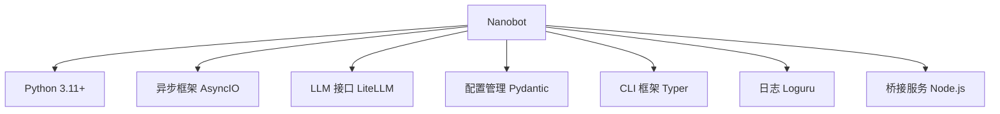
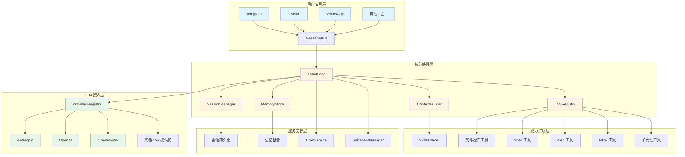
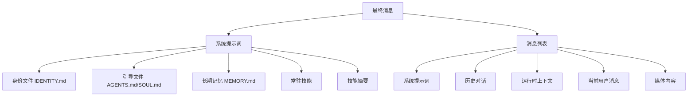
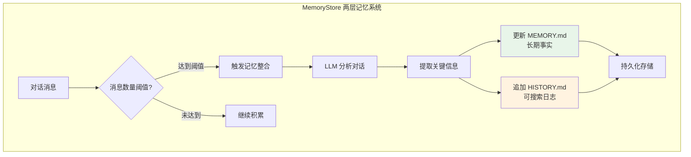
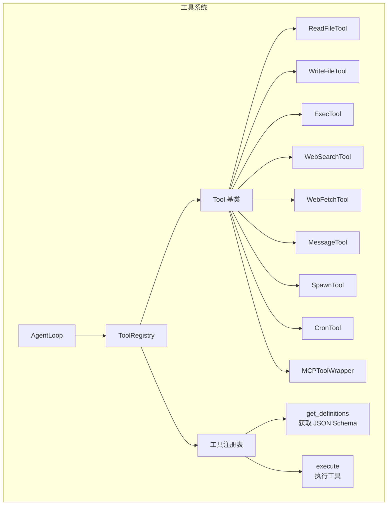
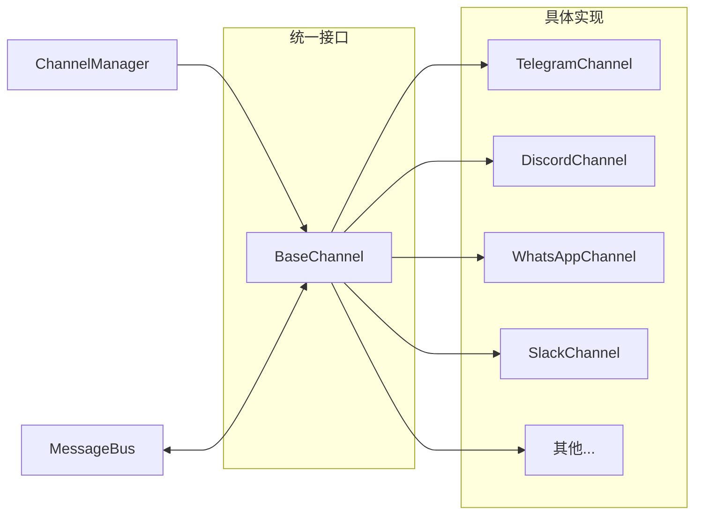
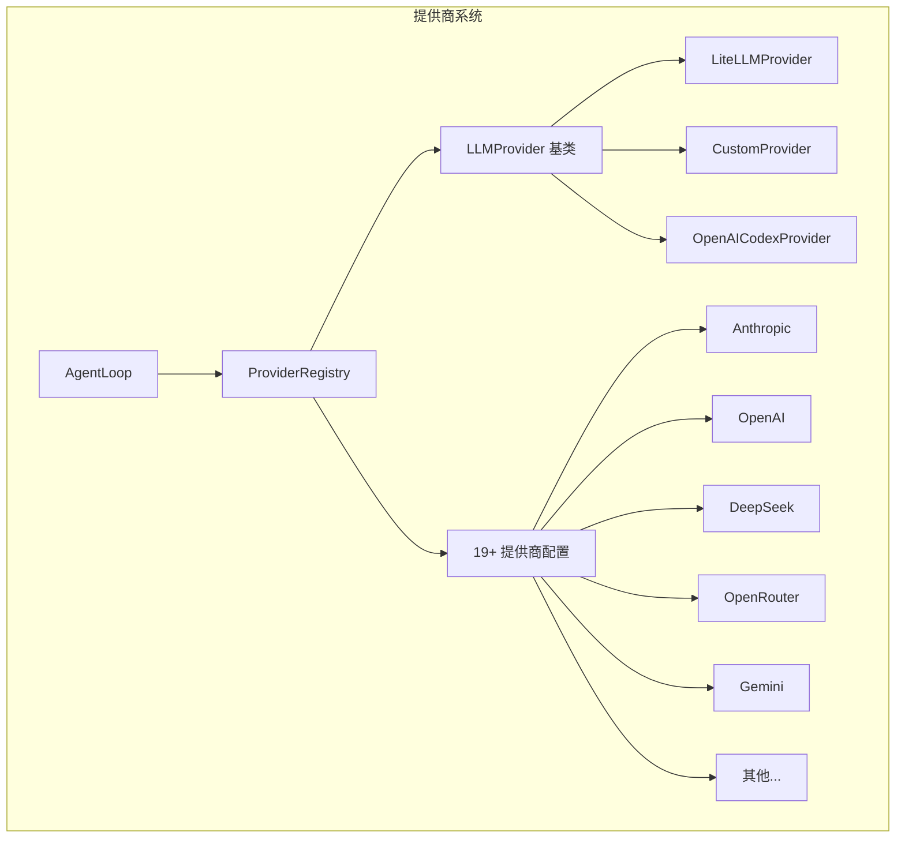
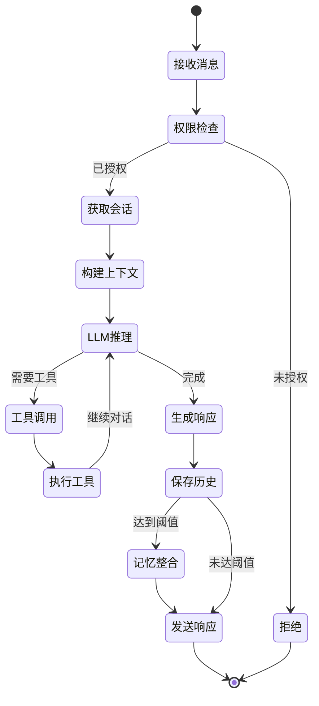
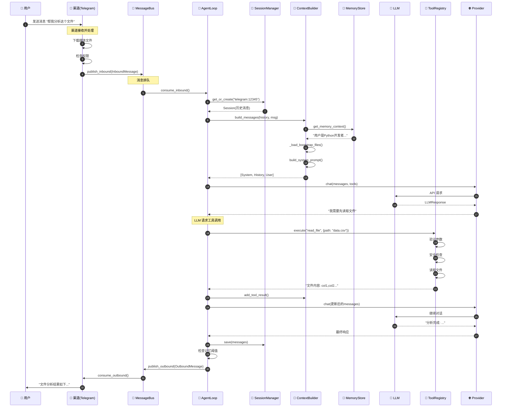
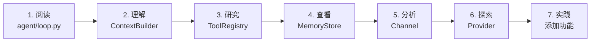

# Nanobot 架构完全指南：从零理解 AI Agent 实现

> **面向初学者的完整指南** - 本文档将深入剖析 nanobot 的内部实现，帮助工程师理解如何从零开始构建一个生产级 AI Agent

---

## 📚 目录

1. [项目概述](#项目概述)
2. [整体架构](#整体架构)
3. [目录结构详解](#目录结构详解)
4. [核心模块实现](#核心模块实现)
5. [关键代码分析](#关键代码分析)
6. [数据流与工作原理](#数据流与工作原理)
7. [扩展指南](#扩展指南)

---

## 项目概述

### 什么是 Nanobot？

**Nanobot** 是一个超轻量级的个人 AI 助手框架，仅用约 4,000 行核心代码实现了完整的代理功能。相比传统 430k+ 行的 AI 助手项目，它精简了 99% 的代码量，却保留了所有核心功能。

### 核心特性

```
✨ 多平台支持     - 支持 10+ 即时通讯平台（Telegram, Discord, WhatsApp 等）
🔌 插件化架构     - 基于技能和工具的可扩展系统
🧠 智能记忆       - 两层记忆系统（长期记忆 + 历史记录）
⚡ 异步处理       - 全异步架构，支持高并发
🛡️ 安全防护       - 命令执行限制、参数验证
🔧 多模型支持     - 支持 19+ LLM 提供商
📅 定时任务       - 内置 cron 调度器
🚀 轻量部署       - 无需外部数据库，Docker 一键部署
```

### 技术栈



---

## 整体架构

### 架构全景图



### 架构分层说明

| 层级 | 职责 | 核心组件 |
|------|------|----------|
| **用户交互层** | 接收用户输入，发送响应 | 各渠道适配器（Telegram, Discord 等） |
| **核心处理层** | 消息处理、决策执行 | AgentLoop, ContextBuilder, ToolRegistry |
| **能力扩展层** | 提供具体能力实现 | 各种工具（文件、Shell、Web 等） |
| **服务支撑层** | 状态管理、持久化 | SessionManager, MemoryStore, CronService |
| **LLM 接入层** | 与大语言模型通信 | Provider Registry, 各提供商实现 |

---

## 目录结构详解

### 完整目录树

```
nanobot/
├── 📁 nanobot/                    # 主项目代码
│   ├── 📄 __init__.py            # 包初始化，版本定义
│   ├── 📄 __main__.py            # 模块入口点
│   │
│   ├── 📁 agent/                 # 🔥 核心代理模块
│   │   ├── 📄 loop.py            # 主处理循环（498 行）
│   │   ├── 📄 context.py         # 上下文构建器
│   │   ├── 📄 memory.py          # 记忆管理系统
│   │   ├── 📄 skills.py          # 技能加载器
│   │   ├── 📄 subagent.py        # 子代理管理器
│   │   │
│   │   └── 📁 tools/             # 工具实现
│   │       ├── 📄 base.py        # 工具基类
│   │       ├── 📄 registry.py    # 工具注册表
│   │       ├── 📄 filesystem.py  # 文件操作工具
│   │       ├── 📄 shell.py       # Shell 执行工具
│   │       ├── 📄 web.py         # Web 工具（搜索/抓取）
│   │       ├── 📄 message.py     # 消息发送工具
│   │       ├── 📄 spawn.py       # 子代理生成工具
│   │       ├── 📄 cron.py        # 定时任务工具
│   │       └── 📄 mcp.py         # MCP 协议工具
│   │
│   ├── 📁 channels/              # 渠道适配器
│   │   ├── 📄 base.py            # 基础渠道接口
│   │   ├── 📄 manager.py         # 渠道管理器
│   │   ├── 📄 telegram.py        # Telegram 适配器
│   │   ├── 📄 discord.py         # Discord 适配器
│   │   ├── 📄 whatsapp.py        # WhatsApp 适配器
│   │   ├── 📄 slack.py           # Slack 适配器
│   │   ├── 📄 matrix.py          # Matrix 适配器
│   │   └── 📄 ...                # 其他渠道
│   │
│   ├── 📁 providers/             # LLM 提供商
│   │   ├── 📄 base.py            # 提供商基类
│   │   ├── 📄 registry.py        # 提供商注册表（19 个）
│   │   ├── 📄 litellm_provider.py # LiteLLM 封装
│   │   ├── 📄 custom_provider.py # 自定义提供商
│   │   └── 📄 openai_codex_provider.py # OpenAI Codex
│   │
│   ├── 📁 bus/                   # 消息总线
│   │   ├── 📄 events.py          # 消息事件定义
│   │   └── 📄 queue.py           # 异步消息队列
│   │
│   ├── 📁 session/               # 会话管理
│   │   ├── 📄 session.py         # 会话数据模型
│   │   └── 📄 manager.py         # 会话管理器
│   │
│   ├── 📁 config/                # 配置管理
│   │   ├── 📄 schema.py          # Pydantic 配置模型
│   │   └── 📄 loader.py          # 配置加载器
│   │
│   ├── 📁 cron/                  # 定时任务
│   │   ├── 📄 service.py         # Cron 服务
│   │   └── 📄 types.py           # Cron 类型定义
│   │
│   ├── 📁 heartbeat/             # 心跳服务
│   │   └── 📄 service.py         # 心跳实现
│   │
│   ├── 📁 skills/                # 内置技能
│   │   ├── 📁 weather/           # 天气查询
│   │   ├── 📁 github/            # GitHub 集成
│   │   ├── 📁 summarize/         # 文本摘要
│   │   ├── 📁 memory/            # 记忆管理
│   │   └── 📁 ...                # 其他技能
│   │
│   ├── 📁 templates/             # 模板文件
│   │   └── 📁 memory/            # 记忆模板
│   │
│   ├── 📁 utils/                 # 工具函数
│   │   └── 📄 helpers.py         # 辅助函数
│   │
│   └── 📁 cli/                   # 命令行接口
│       └── 📄 commands.py        # Typer CLI 命令
│
├── 📁 bridge/                    # WhatsApp 桥接服务（Node.js）
│   ├── 📄 package.json
│   ├── 📄 tsconfig.json
│   └── 📁 src/
│       ├── 📄 index.ts           # 入口
│       ├── 📄 server.ts          # WebSocket 服务器
│       └── 📄 whatsapp.ts        # WhatsApp 集成
│
├── 📁 tests/                     # 测试文件
├── 📁 case/                      # 示例用例
├── 📄 pyproject.toml             # Python 项目配置
├── 📄 Dockerfile                 # Docker 配置
├── 📄 docker-compose.yml         # Docker Compose 配置
└── 📄 README.md                  # 项目文档
```

### 关键文件说明

| 文件 | 作用 | 代码行数 |
|------|------|----------|
| `agent/loop.py` | 核心处理循环 | 498 |
| `cli/commands.py` | CLI 命令实现 | 1116 |
| `config/schema.py` | 配置模型 | 413 |
| `providers/registry.py` | 提供商注册 | ~300 |
| `channels/manager.py` | 渠道管理 | ~200 |

---

## 核心模块实现

### 1. AgentLoop - 核心处理引擎

**位置**: `nanobot/agent/loop.py`

#### 什么是 AgentLoop？

`AgentLoop` 是 nanobot 的大脑，负责：
- 从消息总线接收消息
- 构建对话上下文
- 调用 LLM 进行推理
- 执行工具调用
- 生成最终响应

#### 核心流程

```mermaid
sequenceDiagram
    participant User as 用户
    participant Channel as 渠道
    participant Bus as MessageBus
    participant Loop as AgentLoop
    participant Context as ContextBuilder
    participant LLM as LLM Provider
    participant Tools as ToolRegistry
    participant Session as SessionManager

    User->>Channel: 发送消息
    Channel->>Bus: 发布 InboundMessage
    Bus->>Loop: consume_inbound()
    Loop->>Session: 获取或创建会话
    Session-->>Loop: 返回会话历史
    Loop->>Context: build_messages()
    Context-->>Loop: 构建好的消息列表
    Loop->>LLM: chat(messages, tools)
    LLM-->>Loop: LLMResponse

    alt LLM 请求工具调用
        Loop->>Tools: execute(tool_name, args)
        Tools-->>Loop: 工具执行结果
        Loop->>Context: add_tool_result()
        Loop->>LLM: 继续对话（包含工具结果）
        LLM-->>Loop: 最终响应
    end

    Loop->>Session: 保存消息到历史
    Loop->>Bus: 发布 OutboundMessage
    Bus->>Channel: consume_outbound()
    Channel->>User: 发送响应
```

#### 关键代码实现

```python
# nanobot/agent/loop.py 核心代码片段

class AgentLoop:
    """Nanobot 的核心处理引擎"""

    def __init__(
        self,
        bus: MessageBus,
        provider: LLMProvider,
        model: str,
        context: ContextBuilder,
        tools: ToolRegistry,
        sessions: SessionManager,
        memory: MemoryStore,
        skills: SkillsLoader,
        # ... 其他参数
    ):
        self.bus = bus
        self.provider = provider
        self.model = model
        self.context = context
        self.tools = tools
        self.sessions = sessions
        self.memory = memory
        self.skills = skills
        self._running = False

    async def run(self) -> None:
        """主循环：持续处理消息"""
        self._running = True
        await self._connect_mcp()  # 连接 MCP 服务器

        while self._running:
            try:
                # 从消息总线获取消息（1秒超时）
                msg = await asyncio.wait_for(
                    self.bus.consume_inbound(),
                    timeout=1.0
                )
            except asyncio.TimeoutError:
                continue

            # 处理消息（创建异步任务以保持响应）
            task = asyncio.create_task(self._dispatch(msg))
            self._active_tasks.setdefault(
                msg.session_key, []
            ).append(task)

    async def _process_message(
        self,
        msg: InboundMessage,
        ...
    ) -> OutboundMessage | None:
        """处理单条消息的核心逻辑"""

        # 1. 获取或创建会话
        session = self.sessions.get_or_create(msg.session_key)

        # 2. 构建对话上下文
        history = session.get_history(
            max_messages=self.memory_window
        )
        messages = self.context.build_messages(
            history=history,
            current_message=msg.content,
            media=msg.media,
            channel=msg.channel,
            chat_id=msg.chat_id,
        )

        # 3. 运行 Agent 迭代循环
        final_content, tools_used, all_msgs = await self._run_agent_loop(
            messages,
            on_progress=on_progress,
        )

        # 4. 保存到会话历史
        session.save_many(all_msgs)

        # 5. 检查是否需要记忆整合
        if session.message_count >= self.consolidate_threshold:
            await self.memory.consolidate(
                session=session,
                provider=self.provider,
                model=self.model,
            )

        # 6. 返回响应消息
        return OutboundMessage(
            channel=msg.channel,
            chat_id=msg.chat_id,
            content=final_content,
            reply_to=msg.sender_id,
        )

    async def _run_agent_loop(
        self,
        messages: list[dict],
        on_progress: Callable | None = None,
    ) -> tuple[str, list[str], list[dict]]:
        """Agent 迭代循环：处理 LLM 响应和工具调用"""

        iteration = 0
        final_content = None
        tools_used = []

        while iteration < self.max_iterations:
            iteration += 1

            # 调用 LLM
            response = await self.provider.chat(
                messages=messages,
                tools=self.tools.get_definitions(),
                model=self.model,
                temperature=self.temperature,
            )

            if response.has_tool_calls:
                # 添加助手消息（包含工具调用）
                messages = self.context.add_assistant_message(
                    messages,
                    response.content,
                    response.tool_calls,
                )

                # 执行所有工具调用
                for tool_call in response.tool_calls:
                    tools_used.append(tool_call.name)

                    # 执行工具
                    result = await self.tools.execute(
                        tool_call.name,
                        tool_call.arguments
                    )

                    # 添加工具结果到消息列表
                    messages = self.context.add_tool_result(
                        messages,
                        tool_call.id,
                        tool_call.name,
                        result,
                    )
            else:
                # LLM 返回最终响应
                final_content = response.content
                break

        return final_content, tools_used, messages
```

#### 设计亮点

1. **异步任务调度**: 使用 `asyncio.create_task` 保持主循环响应
2. **迭代循环**: 支持多轮工具调用，直到 LLM 完成任务
3. **自动记忆整合**: 当消息达到阈值时自动整合记忆
4. **进度回调**: 支持流式响应，实时反馈用户

---

### 2. ContextBuilder - 上下文构建器

**位置**: `nanobot/agent/context.py`

#### 作用

`ContextBuilder` 负责构建发送给 LLM 的完整提示词，包括：
- **系统提示词**: AI 的身份和行为指导
- **记忆内容**: 长期记忆中的关键信息
- **技能说明**: 可用能力的描述
- **对话历史**: 历史消息记录
- **运行时上下文**: 时间、渠道、聊天 ID 等元数据

#### 构建层次



#### 代码实现

```python
# nanobot/agent/context.py

class ContextBuilder:
    """构建 AI 对话的完整上下文"""

    def build_system_prompt(
        self,
        skill_names: list[str] | None = None
    ) -> str:
        """构建系统提示词"""
        parts = []

        # 1. 身份定义
        parts.append(self._get_identity())

        # 2. 引导文件（AGENTS.md, SOUL.md, USER.md 等）
        bootstrap = self._load_bootstrap_files()
        if bootstrap:
            parts.append(bootstrap)

        # 3. 长期记忆
        memory = self.memory.get_memory_context()
        if memory:
            parts.append(f"# Memory\n\n{memory}")

        # 4. 常驻技能（总是激活的技能）
        always_skills = self.skills.get_always_skills()
        if always_skills:
            always_content = self.skills.load_skills_for_context(
                always_skills
            )
            if always_content:
                parts.append(f"# Active Skills\n\n{always_content}")

        # 5. 技能摘要（所有可用技能列表）
        skills_summary = self.skills.build_skills_summary()
        if skills_summary:
            parts.append(f"# Skills\n\n{skills_summary}")

        return "\n\n---\n\n".join(parts)

    def build_messages(
        self,
        history: list[dict],
        current_message: str,
        media: list[str] | None = None,
        channel: str | None = None,
        chat_id: str | None = None,
    ) -> list[dict]:
        """构建完整的消息列表"""
        return [
            # 系统提示词
            {
                "role": "system",
                "content": self.build_system_prompt()
            },
            # 历史对话
            *history,
            # 运行时上下文（时间、渠道等）
            {
                "role": "user",
                "content": self._build_runtime_context(
                    channel, chat_id
                )
            },
            # 当前用户消息
            {
                "role": "user",
                "content": self._build_user_content(
                    current_message, media
                )
            },
        ]

    @staticmethod
    def _build_runtime_context(
        channel: str | None,
        chat_id: str | None
    ) -> str:
        """构建运行时元数据（标记为不可信信息）"""
        now = datetime.now().strftime("%Y-%m-%d %H:%M (%A)")
        tz = time.strftime("%Z") or "UTC"

        lines = [f"Current Time: {now} ({tz})"]
        if channel and chat_id:
            lines += [
                f"Channel: {channel}",
                f"Chat ID: {chat_id}"
            ]

        # 使用特殊标签标记为不可信信息
        return (
            ContextBuilder._RUNTIME_CONTEXT_TAG + "\n" +
            "\n".join(lines)
        )
```

#### 安全考虑

运行时上下文使用特殊标签标记，让 LLM 知道这些信息可能是用户伪造的：

```python
_RUNTIME_CONTEXT_TAG = (
    "<runtime_context>"
    "The following metadata is provided by the system "
    "and should be considered accurate."
    "</runtime_context>"
)
```

---

### 3. MemoryStore - 智能记忆系统

**位置**: `nanobot/agent/memory.py`

#### 两层记忆架构



#### 记忆文件

| 文件 | 内容 | 用途 |
|------|------|------|
| `MEMORY.md` | 长期事实和重要信息 | 存储用户偏好、关键上下文 |
| `HISTORY.md` | 带时间戳的历史摘要 | 便于 grep 搜索的对话日志 |

#### 记忆整合流程

```python
# nanobot/agent/memory.py

class MemoryStore:
    """智能记忆管理系统"""

    async def consolidate(
        self,
        session: Session,
        provider: LLMProvider,
        model: str,
        *,
        archive_all: bool = False,
        memory_window: int = 50,
    ) -> bool:
        """
        将旧消息整合到 MEMORY.md 和 HISTORY.md

        这是 nanobot 最智能的功能之一：
        1. 收集需要归档的消息
        2. 调用 LLM 提取关键信息
        3. 更新长期记忆和历史日志
        """

        # 1. 确定要归档的消息
        if archive_all:
            old_messages = session.messages
            keep_count = 0
        else:
            keep_count = memory_window // 2
            old_messages = session.messages[
                session.last_consolidated:-keep_count
            ]

        if not old_messages:
            return False

        # 2. 格式化消息供 LLM 分析
        lines = []
        for msg in old_messages:
            if not msg.get("content"):
                continue
            tools = (
                f" [tools: {', '.join(msg['tools_used'])}]"
                if msg.get("tools_used")
                else ""
            )
            lines.append(
                f"[{msg.get('timestamp', '?')[:16]}] "
                f"{msg['role'].upper()}{tools}: "
                f"{msg['content']}"
            )

        prompt = (
            "请分析以下对话记录，提取重要信息并更新记忆。\n\n"
            f"当前记忆：\n{self.read_long_term()}\n\n"
            f"对话记录：\n" + "\n".join(lines)
        )

        # 3. 调用 LLM（使用 save_memory 工具）
        response = await provider.chat(
            messages=[
                {
                    "role": "system",
                    "content": (
                        "你是记忆整合助手。"
                        "调用 save_memory 工具更新记忆。"
                    )
                },
                {"role": "user", "content": prompt},
            ],
            tools=_SAVE_MEMORY_TOOL,  # 特殊的记忆工具
            model=model,
        )

        # 4. 处理 LLM 的工具调用
        if response.has_tool_calls:
            args = response.tool_calls[0].arguments

            # 更新历史日志
            if entry := args.get("history_entry"):
                self.append_history(entry)

            # 更新长期记忆
            if update := args.get("memory_update"):
                if update != self.read_long_term():
                    self.write_long_term(update)

        return True
```

#### 记忆工具定义

```python
_SAVE_MEMORY_TOOL = [
    {
        "type": "function",
        "function": {
            "name": "save_memory",
            "description": "保存记忆更新",
            "parameters": {
                "type": "object",
                "properties": {
                    "memory_update": {
                        "type": "string",
                        "description": "完整的 MEMORY.md 内容"
                    },
                    "history_entry": {
                        "type": "string",
                        "description": "要追加到 HISTORY.md 的条目"
                    }
                },
                "required": []
            }
        }
    }
]
```

---

### 4. ToolRegistry - 工具系统

**位置**: `nanobot/agent/tools/`

#### 工具系统架构



#### 工具基类

```python
# nanobot/agent/tools/base.py

from abc import ABC, abstractmethod

class Tool(ABC):
    """所有工具的抽象基类"""

    @property
    @abstractmethod
    def name(self) -> str:
        """工具名称（用于函数调用）"""
        pass

    @property
    @abstractmethod
    def description(self) -> str:
        """工具功能描述（给 LLM 看）"""
        pass

    @property
    @abstractmethod
    def parameters(self) -> dict[str, Any]:
        """参数的 JSON Schema"""
        pass

    @abstractmethod
    async def execute(self, **kwargs: Any) -> str:
        """执行工具逻辑"""
        pass

    def validate_params(self, params: dict) -> list[str]:
        """验证参数（可选实现）"""
        return []
```

#### 工具注册表

```python
# nanobot/agent/tools/registry.py

class ToolRegistry:
    """工具注册和执行管理器"""

    def __init__(self):
        self._tools: dict[str, Tool] = {}

    def register(self, tool: Tool) -> None:
        """注册工具"""
        self._tools[tool.name] = tool

    def get_definitions(self) -> list[dict]:
        """获取所有工具的 OpenAI 格式定义"""
        return [
            {
                "type": "function",
                "function": {
                    "name": tool.name,
                    "description": tool.description,
                    "parameters": tool.parameters,
                }
            }
            for tool in self._tools.values()
        ]

    async def execute(
        self,
        name: str,
        params: dict[str, Any]
    ) -> str:
        """执行工具"""
        tool = self._tools.get(name)
        if not tool:
            return (
                f"Error: Tool '{name}' not found. "
                f"Available: {', '.join(self.tool_names)}"
            )

        # 验证参数
        errors = tool.validate_params(params)
        if errors:
            return (
                f"Error: Invalid parameters for '{name}': "
                f"{'; '.join(errors)}"
            )

        # 执行工具
        try:
            result = await tool.execute(**params)
            return result
        except Exception as e:
            return f"Error executing {name}: {str(e)}"
```

#### 文件系统工具示例

```python
# nanobot/agent/tools/filesystem.py

class ReadFileTool(Tool):
    """读取文件内容"""

    name = "read_file"
    description = "读取文件的全部内容"
    parameters = {
        "type": "object",
        "properties": {
            "path": {
                "type": "string",
                "description": "文件路径（相对或绝对）"
            }
        },
        "required": ["path"]
    }

    def __init__(
        self,
        workspace: Path,
        allowed_dir: Path | None = None
    ):
        self.workspace = workspace
        self.allowed_dir = allowed_dir  # 安全限制

    async def execute(self, path: str) -> str:
        """执行文件读取"""
        # 解析路径
        full_path = self._resolve_path(path)

        # 安全检查
        if self.allowed_dir and not self._is_allowed(full_path):
            return f"Error: Access denied for {path}"

        # 读取文件
        try:
            return full_path.read_text(encoding="utf-8")
        except Exception as e:
            return f"Error reading file: {str(e)}"

    def _resolve_path(self, path: str) -> Path:
        """解析路径（支持相对路径）"""
        p = Path(path)
        if p.is_absolute():
            return p
        return self.workspace / p
```

#### Shell 工具安全示例

```python
# nanobot/agent/tools/shell.py

class ExecTool(Tool):
    """安全的 Shell 命令执行"""

    # 危险命令黑名单
    DENY_PATTERNS = [
        r"rm -rf /",
        r"rm -rf \*",
        r":\( \)\{ :\|:& \};:",  # fork bomb
        r"> /dev/",
        r"mkfs\.",
        r"dd if=/",
    ]

    async def execute(
        self,
        command: str,
        timeout: int = 30
    ) -> str:
        """执行命令（带安全检查）"""

        # 1. 检查危险命令
        for pattern in self.DENY_PATTERNS:
            if re.search(pattern, command):
                return (
                    f"Error: Command blocked for safety: {command}"
                )

        # 2. 执行命令（带超时）
        try:
            proc = await asyncio.create_subprocess_shell(
                command,
                stdout=asyncio.subprocess.PIPE,
                stderr=asyncio.subprocess.PIPE,
                cwd=self.working_dir,
                env=self.env,
            )

            stdout, stderr = await asyncio.wait_for(
                proc.communicate(),
                timeout=timeout,
            )

            output = stdout.decode() + stderr.decode()
            return output if output else "(no output)"

        except asyncio.TimeoutError:
            proc.kill()
            return f"Error: Command timed out after {timeout}s"
```

---

### 5. Channel System - 渠道系统

**位置**: `nanobot/channels/`

#### 渠道架构



#### 基础渠道接口

```python
# nanobot/channels/base.py

from abc import ABC, abstractmethod

class BaseChannel(ABC):
    """所有渠道的抽象基类"""

    name: str = "base"

    def __init__(
        self,
        config: Any,
        bus: MessageBus
    ):
        self.config = config
        self.bus = bus
        self._running = False

    @abstractmethod
    async def start(self) -> None:
        """启动渠道（连接平台）"""
        pass

    @abstractmethod
    async def send(self, msg: OutboundMessage) -> None:
        """发送消息到平台"""
        pass

    async def _handle_message(
        self,
        sender_id: str,
        chat_id: str,
        content: str,
        media: list[str] | None = None,
        metadata: dict | None = None,
    ) -> None:
        """处理接收的消息（统一入口）"""

        # 权限检查
        if not self.is_allowed(sender_id):
            logger.warning(
                f"Blocked message from {sender_id} "
                f"(not in allow_from list)"
            )
            return

        # 发布到消息总线
        await self.bus.publish_inbound(
            InboundMessage(
                channel=self.name,
                sender_id=sender_id,
                chat_id=chat_id,
                content=content,
                media=media or [],
                metadata=metadata or {},
            )
        )

    def is_allowed(self, user_id: str) -> bool:
        """检查用户是否有权限"""
        allow_list = self.config.allow_from

        # 空列表 = 拒绝所有
        if not allow_list:
            return False

        # "*" = 允许所有
        if "*" in allow_list:
            return True

        # 检查用户是否在列表中
        return user_id in allow_list
```

#### Telegram 渠道示例

```python
# nanobot/channels/telegram.py

class TelegramChannel(BaseChannel):
    """Telegram 机器人渠道"""

    name = "telegram"

    def __init__(
        self,
        config: TelegramConfig,
        bus: MessageBus
    ):
        super().__init__(config, bus)
        self.application = (
            Application.builder()
            .token(config.token)
            .build()
        )

    async def start(self) -> None:
        """启动 Telegram 机器人"""
        self.application.add_handler(
            MessageHandler(
                filters.ALL,
                self._on_message,
            )
        )

        await self.application.initialize()
        await self.application.start()
        await self.application.updater.start_polling()

        self._running = True
        logger.info("Telegram channel started")

    async def _on_message(
        self,
        update: Update,
        context: ContextTypes.DEFAULT_TYPE
    ) -> None:
        """处理接收的消息"""
        message = update.effective_message
        user = update.effective_user

        # 下载媒体文件
        media = []
        if message.photo:
            # 下载照片...
            pass
        elif message.voice:
            # 转录语音...
            pass

        # 处理文本内容
        content = message.text or message.caption or ""

        # 统一的消息处理
        await self._handle_message(
            sender_id=str(user.id),
            chat_id=str(message.chat_id),
            content=content,
            media=media,
        )

    async def send(self, msg: OutboundMessage) -> None:
        """发送消息到 Telegram"""
        # Telegram 消息长度限制 4000 字符
        chunks = self._split_text(msg.content, 4000)

        for chunk in chunks:
            await self.bot.send_message(
                chat_id=msg.chat_id,
                text=chunk,
                parse_mode="Markdown",
            )
```

---

### 6. Provider System - 提供商系统

**位置**: `nanobot/providers/`

#### 提供商架构



#### 提供商注册表

```python
# nanobot/providers/registry.py

@dataclass(frozen=True)
class ProviderSpec:
    """提供商规格"""
    name: str                      # 提供商名称
    keywords: tuple[str, ...]     # 模型名匹配关键词
    env_key: str                  # 环境变量名
    litellm_prefix: str           # LiteLLM 路由前缀
    is_gateway: bool             # 是否网关（支持任意模型）
    is_local: bool               # 是否本地部署
    is_oauth: bool               # 是否 OAuth 认证
    is_direct: bool              # 是否绕过 LiteLLM
    supports_prompt_caching: bool # 是否支持提示缓存

# 19 个提供商配置
PROVIDER_SPECS = [
    # 网关（支持任意模型）
    ProviderSpec(
        name="openrouter",
        keywords=("openrouter",),
        env_key="OPENROUTER_API_KEY",
        litellm_prefix="openrouter/",
        is_gateway=True,
    ),

    # 标准提供商
    ProviderSpec(
        name="anthropic",
        keywords=("claude-",),
        env_key="ANTHROPIC_API_KEY",
        litellm_prefix="anthropic/",
        supports_prompt_caching=True,
    ),
    ProviderSpec(
        name="openai",
        keywords=("gpt-",),
        env_key="OPENAI_API_KEY",
        litellm_prefix="openai/",
    ),
    ProviderSpec(
        name="deepseek",
        keywords=("deepseek/",),
        env_key="DEEPSEEK_API_KEY",
        litellm_prefix="deepseek/",
    ),

    # ... 更多提供商
]

class ProviderRegistry:
    """提供商注册和选择"""

    def __init__(self, config: ProvidersConfig):
        self.config = config
        self._specs = self._load_specs()

    def get_provider(
        self,
        model: str | None = None
    ) -> tuple[LLMProvider, str]:
        """根据模型名获取提供商"""

        # 1. 尝试匹配提供商
        provider_config, resolved_model = self._match_provider(model)

        # 2. 创建提供商实例
        if provider_config.is_direct:
            # 直接提供商（绕过 LiteLLM）
            provider = CustomProvider(
                api_key=provider_config.api_key,
                api_base=provider_config.api_base,
            )
        else:
            # LiteLLM 提供商
            provider = LiteLLMProvider(
                api_key=provider_config.api_key,
                api_base=provider_config.api_base,
            )

        return provider, resolved_model or model
```

#### LLM 响应标准化

```python
# nanobot/providers/base.py

@dataclass
class LLMResponse:
    """统一的 LLM 响应格式"""
    content: str | None                    # 文本内容
    tool_calls: list[ToolCallRequest]     # 工具调用
    finish_reason: str = "stop"           # 结束原因
    usage: dict[str, int] = field(default_factory=dict)
    reasoning_content: str | None = None  # 推理内容（o1）
    thinking_blocks: list[dict] | None = None  # 思考块

    @property
    def has_tool_calls(self) -> bool:
        """是否有工具调用"""
        return bool(self.tool_calls)

class LLMProvider(ABC):
    """LLM 提供商抽象接口"""

    @abstractmethod
    async def chat(
        self,
        messages: list[dict[str, Any]],
        tools: list[dict[str, Any]] | None = None,
        model: str | None = None,
        temperature: float = 0.7,
        max_tokens: int | None = None,
        **kwargs
    ) -> LLMResponse:
        """发送聊天请求"""
        pass
```

---

## 关键代码分析

### 消息处理完整流程



### 并发处理机制

```python
# AgentLoop 使用异步任务实现并发

async def run(self) -> None:
    """主循环"""
    while self._running:
        msg = await self.bus.consume_inbound()

        # 为每个消息创建独立任务
        task = asyncio.create_task(self._dispatch(msg))

        # 追踪活跃任务
        self._active_tasks.setdefault(
            msg.session_key, []
        ).append(task)

        # 任务完成后自动清理
        task.add_done_callback(
            lambda t: self._cleanup_task(msg.session_key, t)
        )
```

### 会话隔离机制

```python
# SessionManager 实现会话隔离

class SessionManager:
    def get_or_create(self, key: str) -> Session:
        """
        会话键格式: "channel:chat_id"
        例如: "telegram:123456789"
        """
        if key not in self._cache:
            # 尝试从磁盘加载
            session = self._load(key) or Session(key=key)
            self._cache[key] = session

        return self._cache[key]
```

---

## 数据流与工作原理

### 完整消息流



### 核心数据结构

#### InboundMessage（入站消息）

```python
@dataclass
class InboundMessage:
    """从渠道到 Agent 的消息"""
    channel: str                      # 渠道名称
    sender_id: str                    # 发送者 ID
    chat_id: str                      # 聊天 ID
    content: str                      # 消息内容
    timestamp: datetime               # 时间戳
    media: list[str] = field(default_factory=list)  # 媒体文件路径
    metadata: dict = field(default_factory=dict)    # 元数据

    @property
    def session_key(self) -> str:
        """生成会话键"""
        return f"{self.channel}:{self.chat_id}"
```

#### OutboundMessage（出站消息）

```python
@dataclass
class OutboundMessage:
    """从 Agent 到渠道的消息"""
    channel: str
    chat_id: str
    content: str
    reply_to: str | None = None       # 回复消息 ID
    media: list[str] = field(default_factory=list)
    metadata: dict = field(default_factory=dict)
```

#### Session（会话）

```python
@dataclass
class Session:
    """用户会话"""
    key: str                          # "channel:chat_id"
    messages: list[dict] = field(default_factory=list)
    created_at: datetime = field(default_factory=datetime.now)
    updated_at: datetime = field(default_factory=datetime.now)
    last_consolidated: int = 0        # 上次整合的位置

    def get_history(self, max_messages: int = 50) -> list[dict]:
        """获取历史消息（用于 LLM 上下文）"""
        return self.messages[-max_messages:]

    def save(self, role: str, content: str, **kwargs):
        """保存消息"""
        self.messages.append({
            "role": role,
            "content": content,
            "timestamp": datetime.now().isoformat(),
            **kwargs
        })
        self.updated_at = datetime.now()
```

---

## 扩展指南

### 如何添加新渠道

```python
# 1. 继承 BaseChannel
class MyChannel(BaseChannel):
    name = "my_platform"

    def __init__(self, config: MyConfig, bus: MessageBus):
        super().__init__(config, bus)
        # 初始化平台客户端

    async def start(self) -> None:
        """连接到平台"""
        # 设置消息处理器
        pass

    async def send(self, msg: OutboundMessage) -> None:
        """发送消息"""
        # 调用平台 API 发送消息
        pass

    async def _on_platform_message(self, event):
        """处理平台事件"""
        await self._handle_message(
            sender_id=event.user_id,
            chat_id=event.chat_id,
            content=event.text,
        )
```

### 如何添加新工具

```python
# 1. 继承 Tool 基类
class MyTool(Tool):
    name = "my_tool"
    description = "我的工具描述"

    parameters = {
        "type": "object",
        "properties": {
            "param1": {
                "type": "string",
                "description": "参数1"
            }
        },
        "required": ["param1"]
    }

    def __init__(self, config: MyConfig):
        self.config = config

    async def execute(self, param1: str) -> str:
        """执行工具逻辑"""
        try:
            # 实现工具功能
            result = do_something(param1)
            return f"成功: {result}"
        except Exception as e:
            return f"错误: {str(e)}"

# 2. 注册工具
registry.register(MyTool(config))
```

### 如何添加新技能

```markdown
---
name: my_skill
description: 我的技能描述
requirements:
  bins: ["python"]
  env: ["MY_API_KEY"]
---

# 技能名称

你是一个专门的助手，可以...

## 使用方法

当用户需要...时，使用以下工具...

## 示例

用户: ...
助手: [调用工具] ...
```

### 如何添加新提供商

```python
# 1. 在 registry.py 中添加配置
PROVIDER_SPECS.append(
    ProviderSpec(
        name="my_provider",
        keywords=("my-model-",),
        env_key="MY_PROVIDER_API_KEY",
        litellm_prefix="my_provider/",
    )
)

# 2. 或创建自定义提供商
class MyProvider(LLMProvider):
    async def chat(
        self,
        messages: list[dict],
        tools: list[dict] | None = None,
        **kwargs
    ) -> LLMResponse:
        # 调用提供商 API
        response = await self._client.chat(
            messages=messages,
            tools=tools,
        )

        # 转换为统一格式
        return LLMResponse(
            content=response.text,
            tool_calls=response.tool_calls,
        )
```

---

## 总结

### Nanobot 的核心优势

| 特性 | 优势 | 实现方式 |
|------|------|----------|
| **轻量级** | 仅 4,000 行代码 | 精简架构，无冗余功能 |
| **插件化** | 易于扩展 | 工具、技能、渠道全可插拔 |
| **异步处理** | 高并发支持 | AsyncIO 全异步架构 |
| **智能记忆** | 长期上下文保留 | LLM 驱动的记忆整合 |
| **安全防护** | 生产环境可靠 | 参数验证、命令过滤、权限控制 |
| **多平台** | 统一接口 | BaseChannel 抽象层 |
| **多模型** | 灵活切换 | Provider Registry 自动路由 |

### 学习路径建议



### 关键文件学习顺序

1. **`bus/queue.py`** - 理解消息传递机制
2. **`agent/context.py`** - 理解提示词构建
3. **`agent/loop.py`** - 理解核心处理流程
4. **`agent/tools/base.py`** - 理解工具抽象
5. **`channels/base.py`** - 理解渠道抽象
6. **`providers/base.py`** - 理解 LLM 接口

---

## 附录

### A. 环境变量配置

```bash
# LLM 提供商
ANTHROPIC_API_KEY=sk-ant-...
OPENAI_API_KEY=sk-openai-...
DEEPSEEK_API_KEY=...

# 渠道配置
TELEGRAM_BOT_TOKEN=123456:ABC-DEF...
DISCORD_BOT_TOKEN=MTIzNDU2...

# 工具配置
BRAVE_SEARCH_API_KEY=BSG...
```

### B. 配置文件示例

```yaml
# ~/.nanobot/config.yaml
agents:
  default_model: claude-3-5-sonnet-20241022
  default_provider: auto
  memory_window: 50
  consolidate_threshold: 100

channels:
  telegram:
    enabled: true
    token: ${TELEGRAM_BOT_TOKEN}
    allow_from: ["*"]

  discord:
    enabled: true
    token: ${DISCORD_BOT_TOKEN}
    allow_from: ["*"]

providers:
  anthropic:
    api_key: ${ANTHROPIC_API_KEY}
  openai:
    api_key: ${OPENAI_API_KEY}

tools:
  web:
    search_enabled: true
    brave_api_key: ${BRAVE_SEARCH_API_KEY}

  exec:
    enabled: true
    deny_patterns:
      - "rm -rf /"
```

### C. 常用命令

```bash
# 初始化配置
nanobot onboard

# 启动网关服务
nanobot gateway

# 直接对话
nanobot agent

# 查看渠道状态
nanobot channels status

# WhatsApp 登录
nanobot channels login whatsapp

# 管理定时任务
nanobot cron list
nanobot cron add "0 9 * * *" "发送日报"
```

---

**文档版本**: 1.0.0
**最后更新**: 2026-03-03
**对应 Nanobot 版本**: 0.1.4.post3

---

> 💡 **提示**: 本文档配合源代码阅读效果更佳。建议先通读一遍理解整体架构，然后深入感兴趣的模块源码。
