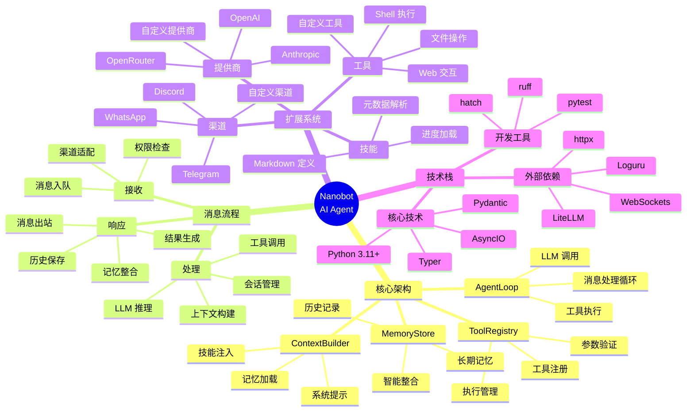
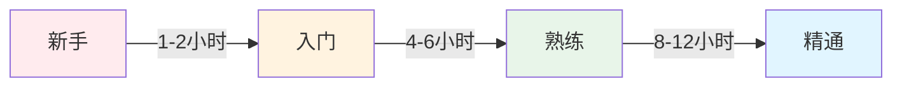
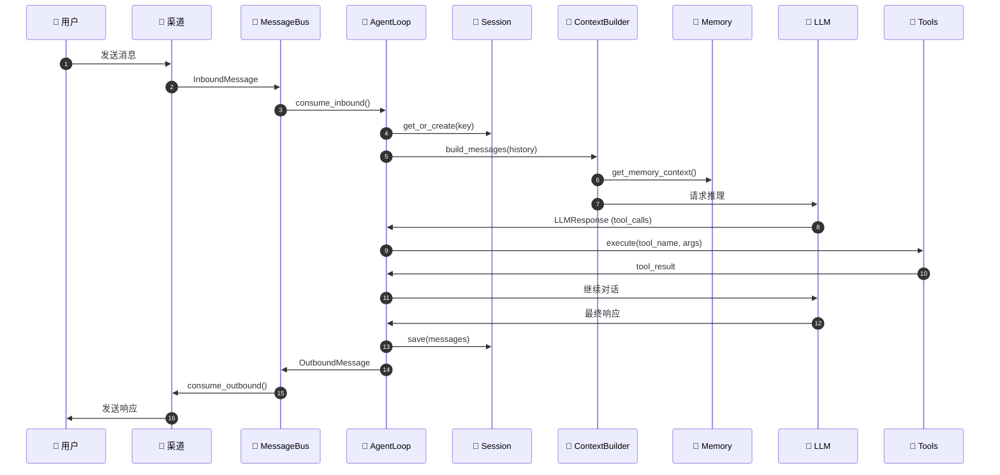

# Nanobot 项目概览与文档总结

> **为 AI Agent 初学者准备的项目全景图** - 一图胜千言

---

## 📊 文档完成情况

### ✅ 已完成的核心文档

| # | 文档名称 | 文件 | 字数 | 内容概要 |
|---|---------|------|------|----------|
| 1 | **架构完全指南** | `NANOBOT_ARCHITECTURE_GUIDE.md` | ~18,000 | 完整的项目架构分析、模块详解、关键代码实现 |
| 2 | **工作流程详解** | `WORKFLOW_GUIDE.md` | ~15,000 | 启动流程、消息处理、工具调用、记忆整合、并发处理 |
| 3 | **代码示例集** | `CODE_EXAMPLES.md` | ~12,000 | 13个可直接运行的代码示例 |
| 4 | **快速入门** | `QUICK_START.md` | ~4,000 | 5分钟快速上手指南 |
| 5 | **文档中心** | `README.md` | ~2,000 | 文档导航和学习路径 |

**总计**: 5 篇核心文档，约 **51,000 字**

---

## 🗺️ 知识图谱



---

## 📈 学习曲线



### 各阶段建议

#### 新手阶段（1-2小时）
- ✅ 阅读"快速入门"
- ✅ 安装并运行 nanobot
- ✅ 尝试基础对话
- ✅ 理解基本概念

#### 入门阶段（4-6小时）
- ✅ 阅读"架构完全指南"
- ✅ 理解核心模块
- ✅ 运行代码示例
- ✅ 尝试简单配置

#### 熟练阶段（8-12小时）
- ✅ 阅读"工作流程详解"
- ✅ 理解消息处理流程
- ✅ 创建自定义工具
- ✅ 添加新渠道

#### 精通阶段（持续学习）
- ✅ 深入阅读源代码
- ✅ 贡献代码
- ✅ 设计高级功能
- ✅ 优化系统性能

---

## 🎯 核心概念速查

### 1. 消息流

```
用户消息 → 渠道 → MessageBus → AgentLoop → LLM
                ↓                          ↓
            OutboundMessage ← 响应 ← 工具执行
```

### 2. 会话隔离

```
session_key = "channel:chat_id"
例如："telegram:123456789"

每个 session_key 有独立的：
- 对话历史
- 记忆上下文
- 运行状态
```

### 3. 工具调用流程

```
1. LLM 返回 tool_calls
2. AgentLoop 解析工具调用
3. ToolRegistry.execute()
4. Tool.execute() 执行
5. 结果返回 LLM
6. LLM 生成最终响应
```

### 4. 记忆整合

```
触发条件：消息数 >= consolidate_threshold

流程：
1. 收集旧消息
2. LLM 提取关键信息
3. 更新 MEMORY.md（长期事实）
4. 追加 HISTORY.md（可搜索日志）
```

---

## 📁 项目文件导航

### 核心模块结构

```
nanobot/
├── agent/                 ⭐ 核心 Agent 逻辑
│   ├── loop.py           # 主处理循环
│   ├── context.py        # 上下文构建
│   ├── memory.py         # 记忆系统
│   ├── skills.py         # 技能加载
│   ├── subagent.py       # 子代理管理
│   └── tools/            # 工具实现
│       ├── base.py       # 工具基类
│       ├── registry.py   # 工具注册
│       ├── filesystem.py # 文件操作
│       ├── shell.py      # Shell 执行
│       ├── web.py        # Web 工具
│       └── ...
│
├── channels/             📱 渠道适配器
│   ├── base.py          # 基础接口
│   ├── manager.py       # 渠道管理
│   ├── telegram.py      # Telegram
│   ├── discord.py       # Discord
│   ├── whatsapp.py      # WhatsApp
│   └── ...
│
├── providers/            🤖 LLM 提供商
│   ├── base.py          # 提供商基类
│   ├── registry.py      # 提供商注册（19个）
│   ├── litellm_provider.py
│   └── custom_provider.py
│
├── bus/                  🚌 消息总线
│   ├── events.py        # 消息事件
│   └── queue.py         # 消息队列
│
├── session/              💾 会话管理
│   ├── session.py       # 会话模型
│   └── manager.py       # 会话管理器
│
├── config/               ⚙️ 配置管理
│   ├── schema.py        # Pydantic 模型
│   └── loader.py        # 配置加载
│
├── skills/               📚 内置技能
│   ├── weather/
│   ├── github/
│   └── ...
│
└── cli/                  💻 命令行接口
    └── commands.py      # Typer 命令
```

### 重要文件说明

| 文件 | 行数 | 功能 | 优先级 |
|------|------|------|--------|
| `agent/loop.py` | 498 | 主处理循环 | ⭐⭐⭐ |
| `cli/commands.py` | 1116 | CLI 命令 | ⭐⭐ |
| `config/schema.py` | 413 | 配置模型 | ⭐⭐ |
| `agent/context.py` | ~300 | 上下文构建 | ⭐⭐⭐ |
| `agent/memory.py` | ~200 | 记忆系统 | ⭐⭐⭐ |
| `providers/registry.py` | ~300 | 提供商注册 | ⭐⭐ |
| `channels/manager.py` | ~200 | 渠道管理 | ⭐⭐ |

---

## 🔑 关键设计模式

### 1. 插件化架构

```python
# 工具注册
tools = ToolRegistry()
tools.register(MyTool())

# 渠道注册
channels = {
    "telegram": TelegramChannel,
    "discord": DiscordChannel,
}

# 提供商注册
provider_registry.register("my_provider", spec)
```

### 2. 消息驱动

```python
# 发布-订阅模式
await bus.publish_inbound(InboundMessage(...))
msg = await bus.consume_inbound()
```

### 3. 异步处理

```python
# 并发消息处理
task = asyncio.create_task(self._dispatch(msg))

# Session 锁
async with self._session_locks[session_key]:
    await self._process_message(msg)
```

### 4. 抽象层

```python
# 工具抽象
class Tool(ABC):
    @abstractmethod
    async def execute(self, **kwargs) -> str:
        pass

# 渠道抽象
class BaseChannel(ABC):
    @abstractmethod
    async def send(self, msg: OutboundMessage):
        pass

# 提供商抽象
class LLMProvider(ABC):
    @abstractmethod
    async def chat(self, messages, **kwargs) -> LLMResponse:
        pass
```

---

## 📊 数据流图

### 完整消息处理流程



---

## 🎓 学习检查清单

### 基础知识检查

- [ ] 理解什么是 AI Agent
- [ ] 了解 nanobot 的核心功能
- [ ] 知道如何安装和运行
- [ ] 能够与 agent 进行基本对话

### 架构理解检查

- [ ] 理解消息总线的角色
- [ ] 知道 AgentLoop 的工作流程
- [ ] 理解会话隔离机制
- [ ] 了解工具调用流程
- [ ] 理解记忆整合系统

### 开发能力检查

- [ ] 能够创建自定义工具
- [ ] 能够添加新渠道
- [ ] 能够编写技能文件
- [ ] 能够配置新提供商
- [ ] 理解错误处理机制

---

## 📈 性能指标

### 代码统计

| 指标 | 数值 |
|------|------|
| 核心代码行数 | ~4,000 |
| Python 文件数 | 50+ |
| 工具数量 | 15+ |
| 渠道数量 | 10+ |
| 提供商数量 | 19+ |
| 技能数量 | 8+ |

### 性能特点

| 特性 | 描述 |
|------|------|
| 启动时间 | < 5秒 |
| 内存占用 | < 200MB |
| 响应延迟 | 取决于 LLM |
| 并发处理 | 支持 session 级并发 |
| 消息吞吐 | 取决于 LLM API 限制 |

---

## 🔄 版本演进

### v0.1.4 (当前版本)

**核心特性:**
- ✅ 完整的 Agent 框架
- ✅ 多渠道支持
- ✅ 工具系统
- ✅ 技能系统
- ✅ 记忆整合
- ✅ 定时任务

**技术栈:**
- Python 3.11+
- AsyncIO
- Pydantic v2
- LiteLLM

### 未来计划

**v0.2.0:**
- [ ] 更多的内置工具
- [ ] 性能优化
- [ ] 更好的文档
- [ ] Web UI

**v0.3.0:**
- [ ] 多 Agent 协作
- [ ] 更智能的记忆系统
- [ ] 分布式部署
- [ ] 监控和日志

---

## 📚 推荐学习资源

### 内部资源

1. **[架构完全指南](./NANOBOT_ARCHITECTURE_GUIDE.md)** ⭐
   - 必读！完整的项目架构分析

2. **[工作流程详解](./WORKFLOW_GUIDE.md)** ⭐
   - 深入理解核心流程

3. **[代码示例集](./CODE_EXAMPLES.md)** ⭐
   - 实践代码示例

4. **[快速入门](./QUICK_START.md)**
   - 快速上手指南

### 外部资源

**Python 异步编程:**
- [Python AsyncIO 官方文档](https://docs.python.org/3/library/asyncio.html)
- [Real Python: Async IO](https://realpython.com/async-io-python/)

**LLM 开发:**
- [Anthropic 官方文档](https://docs.anthropic.com/)
- [OpenAI API 文档](https://platform.openai.com/docs/)
- [LangChain 文档](https://python.langchain.com/)

**相关项目:**
- [OpenClaw](https://github.com/anthropics/open-claw) - Nanobot 的灵感来源
- [LangChain](https://github.com/langchain-ai/langchain) - AI 应用框架
- [AutoGen](https://github.com/microsoft/autogen) - 多 Agent 系统

---

## 🎉 总结

### Nanobot 的优势

| 优势 | 说明 |
|------|------|
| **轻量级** | 仅 4,000 行代码，易于理解 |
| **模块化** | 清晰的模块划分，易于扩展 |
| **异步** | 全异步架构，高性能 |
| **可插拔** | 工具、渠道、技能都可插拔 |
| **生产就绪** | 完善的错误处理和日志 |

### 适用场景

✅ **适合使用 Nanobot 的场景:**
- 个人 AI 助手
- 聊天机器人
- 自动化任务
- 学习 AI Agent 开发
- 快速原型开发

❌ **不适合的场景:**
- 大规模企业应用（考虑 LangChain）
- 需要复杂编排（考虑 AutoGen）
- 高度定制化需求（建议自己开发）

---

## 📞 反馈与贡献

### 如何反馈

- **Bug 报告**: [GitHub Issues](https://github.com/nanobot-ai/nanobot/issues)
- **功能建议**: [GitHub Discussions](https://github.com/nanobot-ai/nanobot/discussions)
- **文档改进**: 提交 PR 到 docs 分支

### 如何贡献

1. **改进文档**: 修正错误，补充内容
2. **添加示例**: 贡献代码示例
3. **修复 Bug**: 提交修复 PR
4. **添加功能**: 实现新功能

---

## 📊 文档统计

### 已完成文档

| 类别 | 数量 | 总字数 |
|------|------|--------|
| 核心文档 | 5 | ~51,000 |
| 代码示例 | 13+ | - |
| 架构图 | 20+ | - |

### 覆盖内容

✅ **项目架构** - 完整覆盖
✅ **核心模块** - 深入分析
✅ **工作流程** - 详细说明
✅ **代码示例** - 丰富实用
✅ **快速入门** - 清晰易懂

---

**文档版本**: 1.0.0
**最后更新**: 2026-03-03
**对应 Nanobot 版本**: 0.1.4.post3

---

> 🎯 **建议**: 先阅读"快速入门"，然后按照"架构完全指南" → "工作流程详解" → "代码示例集"的顺序深入学习。

> 💡 **提示**: 配合源代码阅读效果更佳。建议在阅读文档的同时，打开相应的源文件对照学习。
