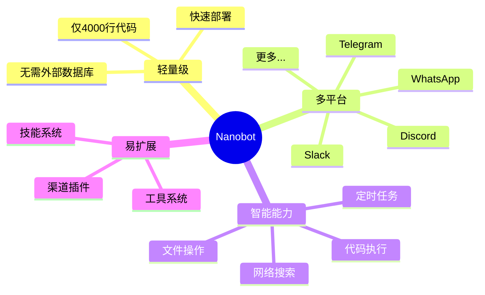

# Nanobot 快速入门

> **5 分钟上手你的第一个 AI Agent** - 最简单的入门指南

---

## 🎯 什么是 Nanobot？

**Nanobot** 是一个超轻量级的个人 AI 助手框架。简单来说，它可以：
- 在多个聊天平台上运行（Telegram, Discord, WhatsApp 等）
- 使用你喜欢的 AI 模型（Claude, GPT-4, 等）
- 执行各种任务（文件操作、代码运行、网络搜索等）
- 记住你和它的对话（智能记忆系统）
- 通过简单的 Markdown 文件扩展功能

### 核心特点



---

## 📋 环境要求

### 基础要求

- **Python**: 3.11 或更高版本
- **操作系统**: Linux, macOS, Windows
- **内存**: 至少 2GB RAM
- **磁盘**: 至少 500MB 可用空间

### 可选要求

- **Docker**: 用于容器化部署
- **Node.js**: 用于 WhatsApp 桥接（如果需要）

### 检查环境

```bash
# 检查 Python 版本
python --version
# 应该显示 Python 3.11.x 或更高

# 检查 pip
pip --version
```

---

## 🚀 快速安装

### 方法 1: 使用 pip 安装（推荐）

```bash
# 1. 安装 nanobot
pip install nanobot-ai

# 2. 初始化配置
nanobot onboard

# 3. 启动服务
nanobot gateway
```

### 方法 2: 从源码安装

```bash
# 1. 克隆仓库
git clone https://github.com/nanobot-ai/nanobot.git
cd nanobot

# 2. 安装依赖
pip install -e .

# 3. 初始化配置
nanobot onboard

# 4. 启动服务
nanobot gateway
```

### 方法 3: 使用 Docker

```bash
# 1. 拉取镜像
docker pull nanobotai/nanobot:latest

# 2. 运行容器
docker run -d \
  --name nanobot \
  -v ~/.nanobot:/app/data \
  -p 8080:8080 \
  nanobotai/nanobot:latest
```

---

## ⚙️ 配置向导

### 运行 onboarding

```bash
nanobot onboard
```

### 配置问题

**1. 选择 LLM 提供商**

```
请选择你的 LLM 提供商:
  [1] Anthropic (Claude)
  [2] OpenAI (GPT)
  [3] OpenRouter (多模型)
  [4] 自定义

输入选择 (1-4): 1
```

**2. 输入 API 密钥**

```
请输入 Anthropic API Key:
sk-ant-xxxxx...
```

**3. 选择默认模型**

```
请选择默认模型:
  [1] claude-3-5-sonnet-20241022 (推荐)
  [2] claude-3-opus-20240229
  [3] claude-3-haiku-20240307

输入选择 (1-3): 1
```

**4. 配置渠道**

```
配置消息渠道:

1. 是否启用 Telegram? (y/n): y
   请输入 Telegram Bot Token: 123456:ABC-DEF...

2. 是否启用 Discord? (y/n): n

3. 是否启用 WhatsApp? (y/n): n
```

**5. 完成配置**

```
✅ 配置完成！

配置文件: ~/.nanobot/config.yaml
工作空间: ~/.nanobot/workspace

下一步:
  - 运行 'nanobot gateway' 启动服务
  - 运行 'nanobot agent' 直接对话
```

---

## 💬 基础使用

### 启动网关服务

```bash
nanobot gateway
```

你会看到类似的输出：

```
2026-03-03 10:00:00 | INFO     | Starting nanobot gateway
2026-03-03 10:00:01 | INFO     | Loaded config from ~/.nanobot/config.yaml
2026-03-03 10:00:02 | INFO     | Provider: Anthropic (claude-3-5-sonnet-20241022)
2026-03-03 10:00:03 | INFO     | Channel 'telegram' started
2026-03-03 10:00:04 | INFO     | Agent loop started
2026-03-03 10:00:05 | INFO     | System ready, waiting for messages...
```

### 与 Agent 对话

#### 方法 1: 通过 Telegram

1. 在 Telegram 中找到你的 bot
2. 发送消息：

```
你好！
```

Bot 会回复：

```
你好！我是 nanobot，你的 AI 助手。
我可以帮助你完成各种任务，比如：
- 读取和编辑文件
- 执行命令
- 搜索网络
- 设置提醒

有什么我可以帮助你的吗？
```

#### 方法 2: 通过命令行

```bash
nanobot agent
```

然后直接输入消息：

```
You: 你好！
Bot: 你好！我是 nanobot...
```

### 常用命令

```
/new        - 创建新会话
/help       - 显示帮助信息
/stop       - 停止当前任务
/status     - 查看系统状态
```

---

## 🎯 基础任务示例

### 示例 1: 文件操作

**用户:**
```
请帮我读取 README.md 文件的内容
```

**Nanobot:**
```
[调用 read_file 工具]

好的，我找到了 README.md 文件。内容如下：

# Nanobot

Nanobot 是一个轻量级的 AI 助手框架...

（文件内容）
```

### 示例 2: 代码执行

**用户:**
```
帮我计算 1 到 100 的和
```

**Nanobot:**
```
[调用 exec 工具]

我使用 Python 计算了结果：

```python
sum(range(1, 101))
```

结果：5050
```

### 示例 3: 网络搜索

**用户:**
```
搜索最新的 Python 版本
```

**Nanobot:**
```
[调用 web_search 工具]

根据搜索结果，Python 的最新版本是：
- Python 3.13.0 (2024年10月发布)
- Python 3.12.7 (2024年10月发布)

（详细搜索结果）
```

### 示例 4: 定时任务

**用户:**
```
每天早上 9 点提醒我喝水
```

**Nanobot:**
```
[调用 cron 工具]

好的！我已经设置了定时提醒：
- 时间：每天 9:00
- 提醒内容：记得喝水💧

任务已保存。
```

---

## 🔧 自定义配置

### 修改配置文件

编辑 `~/.nanobot/config.yaml`:

```yaml
# LLM 配置
agents:
  default_model: claude-3-5-sonnet-20241022
  memory_window: 50        # 对话记忆窗口
  max_iterations: 10       # 最大工具调用次数

# 渠道配置
channels:
  telegram:
    enabled: true
    token: ${TELEGRAM_BOT_TOKEN}
    allow_from: ["*"]      # 允许所有用户

# 工具配置
tools:
  exec:
    enabled: true
    working_dir: ~/projects
```

### 添加 API 密钥

编辑 `~/.nanobot/.env`:

```bash
# LLM 提供商
ANTHROPIC_API_KEY=sk-ant-xxxxx
OPENAI_API_KEY=sk-xxxxx

# Web 工具
BRAVE_SEARCH_API_KEY=xxxxx

# 渠道
TELEGRAM_BOT_TOKEN=123456:ABC-DEF
DISCORD_BOT_TOKEN=MTIzNDU2...
```

---

## 📚 下一步

### 学习路径

```
1. ✅ 完成快速入门（现在）
   ↓
2. 阅读架构指南（深入理解）
   ↓
3. 尝试代码示例（实践练习）
   ↓
4. 创建自定义工具（扩展功能）
   ↓
5. 添加新渠道（更多平台）
```

### 推荐阅读

- **[架构完全指南](./NANOBOT_ARCHITECTURE_GUIDE.md)** - 深入理解系统设计
- **[工作流程详解](./WORKFLOW_GUIDE.md)** - 了解消息处理流程
- **[代码示例集](./CODE_EXAMPLES.md)** - 大量实用示例
- **[工具开发指南](./TOOL_DEVELOPMENT.md)** - 创建自定义工具

### 常见问题

<details>
<summary><b>Q: 如何添加新的 LLM 提供商？</b></summary>

A: 编辑 `~/.nanobot/config.yaml`，在 `providers` 部分添加新的提供商配置：

```yaml
providers:
  custom_provider:
    api_key: your-api-key
    api_base: https://api.example.com/v1
```
</details>

<details>
<summary><b>Q: 如何限制访问权限？</b></summary>

A: 在配置文件中使用 `allow_from` 列表：

```yaml
channels:
  telegram:
    allow_from:
      - "123456789"  # 只允许这个用户
      - "987654321"  # 和这个用户
```
</details>

<details>
<summary><b>Q: 如何查看日志？</b></summary>

A: 日志文件位于 `~/.nanobot/logs/`：

```bash
# 查看最新日志
tail -f ~/.nanobot/logs/nanobot.log

# 搜索错误
grep ERROR ~/.nanobot/logs/nanobot.log
```
</details>

---

## 🎓 进阶技巧

### 技巧 1: 使用技能

创建自定义技能目录：

```bash
mkdir -p ~/.nanobot/workspace/skills/my_skill
cd ~/.nanobot/workspace/skills/my_skill

# 创建技能文件
cat > SKILL.md << 'EOF'
---
name: my_skill
description: 我的自定义技能
---

# 技能名称

你是一个专门的助手，可以...

## 使用方法

当用户需要...时，...
EOF
```

### 技巧 2: 自定义系统提示

编辑 `~/.nanobot/workspace/IDENTITY.md`:

```markdown
# 你是谁

你是一个专业的 Python 开发助手。

## 你的专长

- Python 编程
- 代码审查
- 性能优化
- 最佳实践

## 你的风格

- 简洁明了
- 提供代码示例
- 解释清晰
```

### 技巧 3: 使用记忆系统

Nanobot 会自动维护两类记忆：

1. **MEMORY.md** - 长期记忆（用户偏好、重要信息）
2. **HISTORY.md** - 对话历史（可搜索的日志）

查看记忆：

```bash
cat ~/.nanobot/workspace/memory/MEMORY.md
cat ~/.nanobot/workspace/memory/HISTORY.md
```

---

## 🆘 获取帮助

### 文档资源

- **完整文档**: [文档中心](./README.md)
- **架构指南**: [NANOBOT_ARCHITECTURE_GUIDE.md](./NANOBOT_ARCHITECTURE_GUIDE.md)
- **API 参考**: [API 文档](./API_AGENT.md)

### 社区支持

- **GitHub Issues**: [提交问题](https://github.com/nanobot-ai/nanobot/issues)
- **Discussions**: [参与讨论](https://github.com/nanobot-ai/nanobot/discussions)

### 故障排除

如果遇到问题：

1. **查看日志**: `~/.nanobot/logs/nanobot.log`
2. **检查配置**: `~/.nanobot/config.yaml`
3. **运行诊断**: `nanobot doctor`
4. **查阅文档**: [故障排除指南](./TROUBLESHOOTING.md)

---

## 📊 快速参考

### 常用命令

| 命令 | 描述 |
|------|------|
| `nanobot onboard` | 初始化配置 |
| `nanobot gateway` | 启动网关服务 |
| `nanobot agent` | 命令行对话 |
| `nanobot channels status` | 查看渠道状态 |
| `nanobot cron list` | 列出定时任务 |
| `nanobot doctor` | 系统诊断 |

### 重要文件

| 文件 | 用途 |
|------|------|
| `~/.nanobot/config.yaml` | 主配置文件 |
| `~/.nanobot/.env` | 环境变量 |
| `~/.nanobot/workspace/` | 工作空间 |
| `~/.nanobot/logs/` | 日志文件 |

### 目录结构

```
~/.nanobot/
├── config.yaml              # 配置文件
├── .env                     # 环境变量
├── workspace/               # 工作空间
│   ├── skills/              # 技能目录
│   ├── memory/              # 记忆文件
│   │   ├── MEMORY.md
│   │   └── HISTORY.md
│   └── IDENTITY.md          # 系统提示
├── logs/                    # 日志文件
└── sessions/                # 会话数据
```

---

## ✅ 检查清单

在开始之前，确保：

- [ ] Python 3.11+ 已安装
- [ ] pip 可用
- [ ] API 密钥已获取
- [ ] 至少配置了一个渠道
- [ ] 配置文件已正确设置

完成这些后，你就可以开始使用 nanobot 了！

---

**下一步**: 阅读完整的 [架构完全指南](./NANOBOT_ARCHITECTURE_GUIDE.md) 深入了解系统设计。

**文档版本**: 1.0.0
**最后更新**: 2026-03-03
**对应 Nanobot 版本**: 0.1.4.post3
