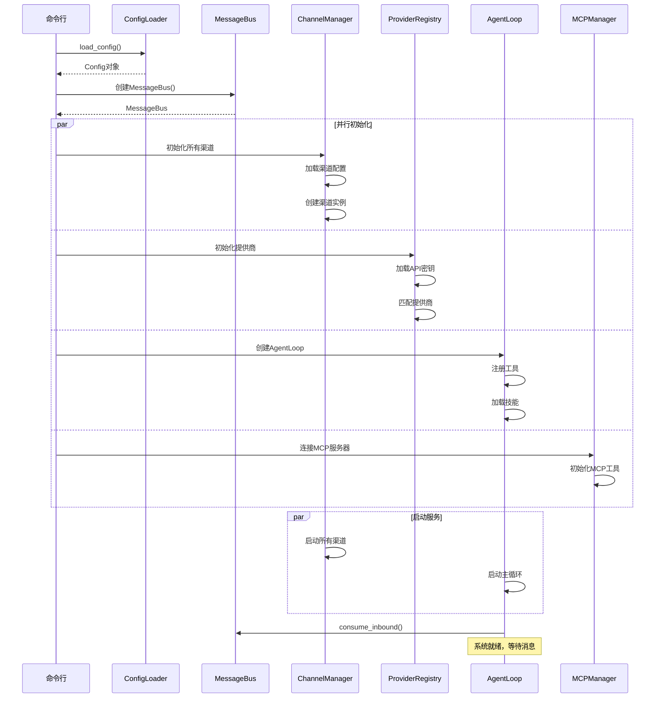
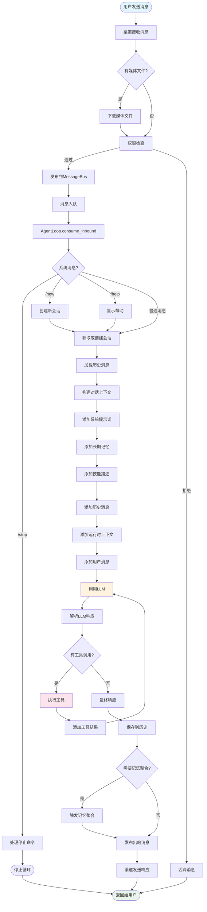
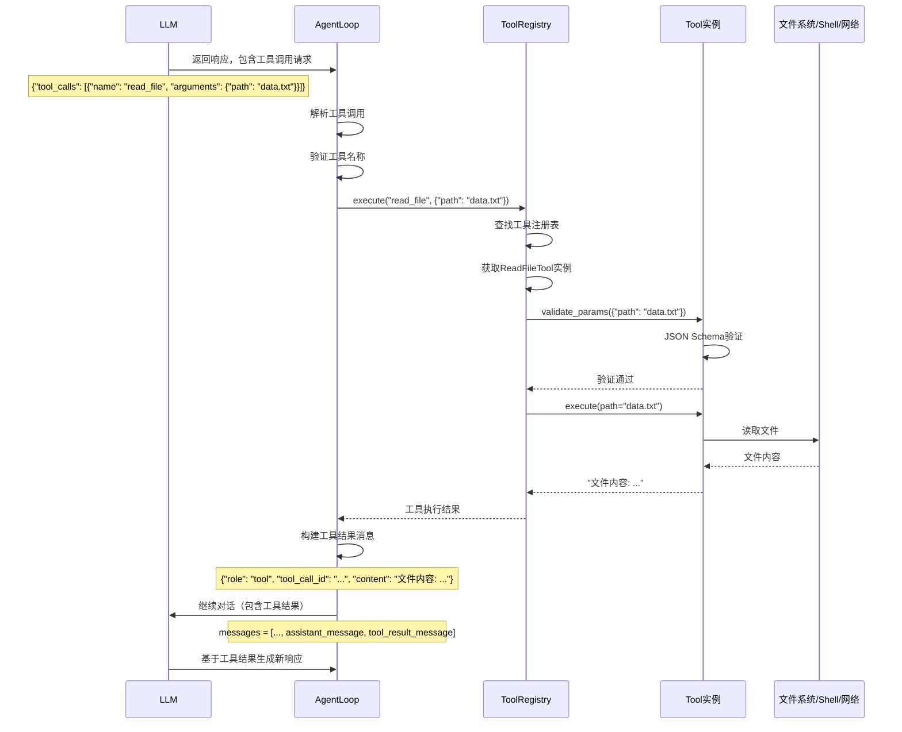
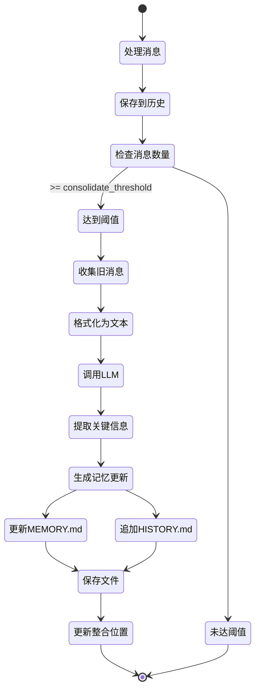
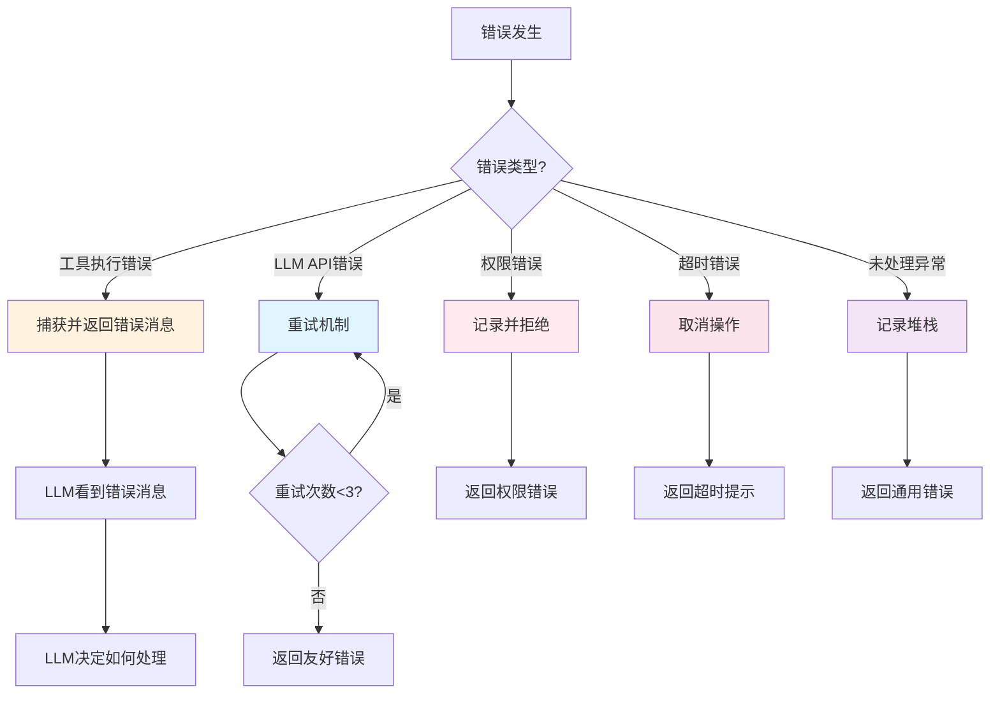

# Nanobot 工作流程详解

> **深入理解 AI Agent 的执行流程** - 本文档详细解析 nanobot 从接收消息到返回响应的完整流程

---

## 📑 目录

1. [启动流程](#启动流程)
2. [消息处理流程](#消息处理流程)
3. [工具调用机制](#工具调用机制)
4. [记忆整合流程](#记忆整合流程)
5. [错误处理机制](#错误处理机制)
6. [并发处理机制](#并发处理机制)

---

## 启动流程

### 系统启动序列图



### 代码实现

```python
# nanobot/cli/commands.py (简化版)

@app.command()
def gateway(config_path: str = None):
    """启动 nanobot 网关服务"""

    # 1. 加载配置
    config = load_config(config_path)

    # 2. 创建消息总线
    bus = MessageBus()

    # 3. 初始化提供商
    provider_registry = ProviderRegistry(config.providers)
    provider, model = provider_registry.get_provider(
        config.agents.default_model
    )

    # 4. 初始化核心组件
    session_manager = SessionManager(workspace)
    memory_store = MemoryStore(workspace)
    skills_loader = SkillsLoader(workspace)
    context_builder = ContextBuilder(
        workspace=workspace,
        memory=memory_store,
        skills=skills_loader,
    )

    # 5. 初始化工具
    tool_registry = ToolRegistry()
    # 注册文件工具
    for cls in [ReadFileTool, WriteFileTool, EditFileTool, ListDirTool]:
        tool_registry.register(cls(workspace=workspace))
    # 注册 Shell 工具
    tool_registry.register(ExecTool(...))
    # 注册 Web 工具
    tool_registry.register(WebSearchTool(...))
    tool_registry.register(WebFetchTool(...))
    # 注册其他工具...

    # 6. 创建 Agent 循环
    agent_loop = AgentLoop(
        bus=bus,
        provider=provider,
        model=model,
        context=context_builder,
        tools=tool_registry,
        sessions=session_manager,
        memory=memory_store,
        skills=skills_loader,
        # ... 其他配置
    )

    # 7. 初始化并启动渠道
    channel_manager = ChannelManager(
        config=config.channels,
        bus=bus,
    )

    # 8. 启动所有服务
    async def run_all():
        # 启动渠道
        await channel_manager.start_all()

        # 启动 Agent 循环
        await agent_loop.run()

    # 运行
    asyncio.run(run_all())
```

---

## 消息处理流程

### 详细处理流程图



### 详细代码流程

```python
# nanobot/agent/loop.py

async def _process_message(
    self,
    msg: InboundMessage,
    on_progress: Callable | None = None,
) -> OutboundMessage | None:
    """
    处理单条消息的完整流程
    """

    # ========== 第1步: 特殊命令处理 ==========

    # 处理系统消息
    if msg.channel == "system":
        return await self._handle_system_message(msg)

    # 处理斜杠命令
    cmd = msg.content.strip().lower()
    if cmd == "/new":
        # 创建新会话
        self.sessions.remove(msg.session_key)
        return OutboundMessage(
            channel=msg.channel,
            chat_id=msg.chat_id,
            content="已创建新会话。",
        )
    elif cmd == "/help":
        # 显示帮助
        return OutboundMessage(
            channel=msg.channel,
            chat_id=msg.chat_id,
            content=self._build_help_text(),
        )

    # ========== 第2步: 获取会话 ==========

    key = msg.session_key
    session = self.sessions.get_or_create(key)

    # ========== 第3步: 构建对话上下文 ==========

    # 3.1 获取历史消息
    history = session.get_history(
        max_messages=self.memory_window
    )

    # 3.2 构建完整消息列表
    messages = self.context.build_messages(
        history=history,
        current_message=msg.content,
        media=msg.media,
        channel=msg.channel,
        chat_id=msg.chat_id,
    )

    logger.debug(
        f"Built context for {key}: "
        f"{len(messages)} messages, "
        f"{len(msg.media)} media files"
    )

    # ========== 第4步: 运行Agent迭代循环 ==========

    final_content, tools_used, all_msgs = await self._run_agent_loop(
        messages,
        on_progress=on_progress or self._bus_progress,
    )

    if not final_content:
        logger.warning(f"No response generated for {key}")
        return None

    # ========== 第5步: 保存到会话历史 ==========

    session.save_many(all_msgs)
    logger.info(
        f"Response for {key}: {len(final_content)} chars, "
        f"tools: {tools_used}"
    )

    # ========== 第6步: 检查记忆整合 ==========

    # 如果消息数量超过阈值，触发记忆整合
    if session.message_count >= self.consolidate_threshold:
        logger.info(f"Triggering memory consolidation for {key}")
        await self.memory.consolidate(
            session=session,
            provider=self.provider,
            model=self.model,
        )
        session.last_consolidated = session.message_count

    # ========== 第7步: 返回响应 ==========

    return OutboundMessage(
        channel=msg.channel,
        chat_id=msg.chat_id,
        content=final_content,
        reply_to=msg.sender_id,
    )

async def _run_agent_loop(
    self,
    messages: list[dict],
    on_progress: Callable[[str], None] | None = None,
) -> tuple[str, list[str], list[dict]]:
    """
    Agent迭代循环：处理LLM响应和工具调用

    返回: (最终内容, 使用的工具列表, 所有消息)
    """

    iteration = 0
    final_content = None
    tools_used = []
    all_messages = messages.copy()

    while iteration < self.max_iterations:
        iteration += 1
        logger.debug(f"Agent iteration {iteration}/{self.max_iterations}")

        # --- 调用LLM ---
        response = await self.provider.chat(
            messages=all_messages,
            tools=self.tools.get_definitions(),
            model=self.model,
            temperature=self.temperature,
            max_tokens=self.max_tokens,
            reasoning_effort=self.reasoning_effort,
        )

        # --- 添加助手消息到历史 ---
        assistant_message = {
            "role": "assistant",
            "content": response.content or "",
            "timestamp": datetime.now().isoformat(),
        }

        # 添加推理内容（o1模型）
        if response.reasoning_content:
            assistant_message["reasoning_content"] = response.reasoning_content

        # 添加思考块（Claude思考模式）
        if response.thinking_blocks:
            assistant_message["thinking_blocks"] = response.thinking_blocks

        # 处理工具调用
        if response.has_tool_calls:
            # 构建工具调用数据
            tool_call_dicts = [
                {
                    "id": tc.id,
                    "name": tc.name,
                    "arguments": tc.arguments,
                }
                for tc in response.tool_calls
            ]
            assistant_message["tool_calls"] = tool_call_dicts
            assistant_message["tools_used"] = [tc.name for tc in response.tool_calls]

        all_messages.append(assistant_message)

        # --- 发送进度更新（流式响应） ---
        if response.content and on_progress:
            await on_progress(response.content)

        # --- 处理工具调用或完成响应 ---
        if response.has_tool_calls:
            # 执行所有工具
            for tool_call in response.tool_calls:
                tool_name = tool_call.name
                tools_used.append(tool_name)

                logger.info(
                    f"Executing tool: {tool_name}"
                    f" with args: {tool_call.arguments}"
                )

                # 执行工具
                result = await self.tools.execute(
                    tool_name,
                    tool_call.arguments
                )

                # 添加工具结果消息
                tool_message = {
                    "role": "tool",
                    "tool_call_id": tool_call.id,
                    "tool_name": tool_name,
                    "content": result,
                    "timestamp": datetime.now().isoformat(),
                }
                all_messages.append(tool_message)

                logger.debug(
                    f"Tool {tool_name} result: "
                    f"{len(result)} chars"
                )
        else:
            # LLM返回最终响应
            final_content = response.content
            logger.info("LLM returned final response")
            break

    # 达到最大迭代次数
    if final_content is None:
        final_content = "任务未完成：达到最大迭代次数。"
        logger.warning("Reached max iterations without completion")

    return final_content, tools_used, all_messages
```

---

## 工具调用机制

### 工具调用流程



### 工具注册与执行

```python
# nanobot/agent/tools/registry.py

class ToolRegistry:
    """工具注册表"""

    def __init__(self):
        self._tools: dict[str, Tool] = {}

    def register(self, tool: Tool) -> None:
        """注册工具"""
        name = tool.name
        if name in self._tools:
            logger.warning(f"Tool '{name}' already registered, overwriting")
        self._tools[name] = tool
        logger.debug(f"Registered tool: {name}")

    def get_definitions(self) -> list[dict]:
        """
        获取所有工具的OpenAI格式定义

        返回格式：
        [
            {
                "type": "function",
                "function": {
                    "name": "read_file",
                    "description": "读取文件内容",
                    "parameters": {
                        "type": "object",
                        "properties": {
                            "path": {
                                "type": "string",
                                "description": "文件路径"
                            }
                        },
                        "required": ["path"]
                    }
                }
            },
            ...
        ]
        """
        definitions = []
        for tool in self._tools.values():
            definitions.append({
                "type": "function",
                "function": {
                    "name": tool.name,
                    "description": tool.description,
                    "parameters": tool.parameters,
                }
            })
        logger.debug(f"Generated definitions for {len(definitions)} tools")
        return definitions

    async def execute(
        self,
        name: str,
        params: dict[str, Any]
    ) -> str:
        """
        执行工具

        参数:
            name: 工具名称
            params: 工具参数（已由LLM解析为字典）

        返回:
            str: 工具执行结果（返回给LLM）
        """
        # 1. 查找工具
        tool = self._tools.get(name)
        if not tool:
            available = ", ".join(self._tools.keys())
            return (
                f"错误：找不到工具 '{name}'。"
                f"可用工具：{available}"
            )

        # 2. 验证参数
        errors = tool.validate_params(params)
        if errors:
            error_msg = f"错误：工具 '{name}' 参数无效：{'; '.join(errors)}"
            logger.error(error_msg)
            return error_msg

        # 3. 执行工具
        logger.info(f"Executing tool '{name}' with params: {params}")
        try:
            result = await tool.execute(**params)
            logger.debug(
                f"Tool '{name}' completed: "
                f"{len(result)} chars output"
            )
            return result
        except Exception as e:
            error_msg = f"工具 '{name}' 执行失败：{str(e)}"
            logger.exception(error_msg)
            return error_msg

    @property
    def tool_names(self) -> list[str]:
        """获取所有工具名称"""
        return list(self._tools.keys())
```

### 具体工具实现示例

#### 1. 文件写入工具

```python
# nanobot/agent/tools/filesystem.py

class WriteFileTool(Tool):
    """写入文件工具"""

    name = "write_file"
    description = "将内容写入文件（会覆盖现有文件）"

    parameters = {
        "type": "object",
        "properties": {
            "path": {
                "type": "string",
                "description": "文件路径"
            },
            "content": {
                "type": "string",
                "description": "要写入的内容"
            }
        },
        "required": ["path", "content"]
    }

    def __init__(
        self,
        workspace: Path,
        allowed_dir: Path | None = None
    ):
        self.workspace = workspace
        self.allowed_dir = allowed_dir

    def validate_params(self, params: dict) -> list[str]:
        """验证参数"""
        errors = []

        # 检查路径
        if "path" not in params:
            errors.append("缺少必需参数 'path'")
        else:
            path = params["path"]
            if not isinstance(path, str):
                errors.append("'path' 必须是字符串")
            elif not path.strip():
                errors.append("'path' 不能为空")

        # 检查内容
        if "content" not in params:
            errors.append("缺少必需参数 'content'")
        elif not isinstance(params["content"], str):
            errors.append("'content' 必须是字符串")

        return errors

    async def execute(
        self,
        path: str,
        content: str
    ) -> str:
        """执行文件写入"""
        # 1. 解析路径
        full_path = self._resolve_path(path)

        # 2. 安全检查
        if self.allowed_dir and not self._is_allowed(full_path):
            return f"错误：访问被拒绝（路径在允许范围之外）：{path}"

        # 3. 检查路径遍历攻击
        try:
            full_path.resolve().relative_to(self.allowed_dir.resolve())
        except ValueError:
            return f"错误：检测到路径遍历攻击：{path}"

        # 4. 创建父目录
        full_path.parent.mkdir(parents=True, exist_ok=True)

        # 5. 写入文件
        try:
            full_path.write_text(content, encoding="utf-8")
            return f"成功：已写入 {len(content)} 字符到 {path}"
        except Exception as e:
            return f"错误：写入文件失败：{str(e)}"

    def _resolve_path(self, path: str) -> Path:
        """解析路径"""
        p = Path(path)
        if p.is_absolute():
            return p
        return self.workspace / p

    def _is_allowed(self, path: Path) -> bool:
        """检查路径是否在允许范围内"""
        if not self.allowed_dir:
            return True
        try:
            path.resolve().relative_to(self.allowed_dir.resolve())
            return True
        except ValueError:
            return False
```

#### 2. Shell 执行工具

```python
# nanobot/agent/tools/shell.py

class ExecTool(Tool):
    """Shell命令执行工具"""

    name = "exec"
    description = "执行Shell命令（有安全限制）"

    parameters = {
        "type": "object",
        "properties": {
            "command": {
                "type": "string",
                "description": "要执行的命令"
            },
            "timeout": {
                "type": "integer",
                "description": "超时时间（秒）",
                "default": 30
            }
        },
        "required": ["command"]
    }

    # 危险命令黑名单
    DENY_PATTERNS = [
        r"rm -rf /",           # 删除根目录
        r"rm -rf \*",          # 删除所有文件
        r":\( \)\{ :\|:& \};:", # Fork炸弹
        r"> /dev/",            # 直接写入设备
        r"mkfs\.",             # 格式化文件系统
        r"dd if=/dev/",        # 直接读取设备
        r"chmod 000 ",         # 移除所有权限
    ]

    def __init__(
        self,
        working_dir: Path | None = None,
        allowed_dirs: list[Path] | None = None,
        deny_patterns: list[str] | None = None,
        timeout: int = 30,
    ):
        self.working_dir = working_dir or Path.cwd()
        self.allowed_dirs = allowed_dirs or [self.working_dir]
        self.deny_patterns = deny_patterns or self.DENY_PATTERNS
        self.default_timeout = timeout

        # 准备环境变量
        self.env = os.environ.copy()
        self.env["PATH"] = os.environ.get("PATH", "/usr/bin:/bin")

    def validate_params(self, params: dict) -> list[str]:
        """验证参数"""
        errors = []

        if "command" not in params:
            errors.append("缺少必需参数 'command'")
        elif not isinstance(params["command"], str):
            errors.append("'command' 必须是字符串")
        elif not params["command"].strip():
            errors.append("'command' 不能为空")

        return errors

    async def execute(
        self,
        command: str,
        timeout: int | None = None
    ) -> str:
        """执行Shell命令"""
        timeout = timeout or self.default_timeout

        # 1. 安全检查
        for pattern in self.deny_patterns:
            if re.search(pattern, command):
                return (
                    f"错误：命令被安全策略阻止：{command}\n"
                    f"匹配模式：{pattern}"
                )

        # 2. 执行命令
        logger.info(f"Executing command: {command}")
        try:
            proc = await asyncio.create_subprocess_shell(
                command,
                stdout=asyncio.subprocess.PIPE,
                stderr=asyncio.subprocess.PIPE,
                cwd=self.working_dir,
                env=self.env,
            )

            # 等待命令完成（带超时）
            try:
                stdout, stderr = await asyncio.wait_for(
                    proc.communicate(),
                    timeout=timeout,
                )
            except asyncio.TimeoutError:
                proc.kill()
                await proc.wait()
                return f"错误：命令执行超时（{timeout}秒）"

            # 3. 处理输出
            stdout_text = stdout.decode("utf-8", errors="replace")
            stderr_text = stderr.decode("utf-8", errors="replace")

            output = stdout_text
            if stderr_text:
                output += f"\n[stderr]\n{stderr_text}"

            # 添加退出状态
            exit_code = proc.returncode
            if exit_code != 0:
                output += f"\n[退出码: {exit_code}]"

            return output if output else "(命令无输出)"

        except Exception as e:
            return f"错误：命令执行失败：{str(e)}"
```

---

## 记忆整合流程

### 记忆整合触发机制



### 记忆整合详细代码

```python
# nanobot/agent/memory.py

class MemoryStore:
    """智能记忆管理系统"""

    def __init__(self, workspace: Path):
        self.workspace = workspace
        self.memory_dir = ensure_dir(workspace / "memory")

        # 记忆文件
        self.memory_file = self.memory_dir / "MEMORY.md"
        self.history_file = self.memory_dir / "HISTORY.md"

        # 初始化文件
        if not self.memory_file.exists():
            self.memory_file.write_text(
                "# 长期记忆\n\n"
                "此文件存储用户的长期信息和偏好。\n"
            )
        if not self.history_file.exists():
            self.history_file.write_text(
                "# 对话历史\n\n"
                "此文件记录对话的摘要，便于搜索。\n\n"
                "---\n\n"
            )

    async def consolidate(
        self,
        session: Session,
        provider: LLMProvider,
        model: str,
        *,
        archive_all: bool = False,
        memory_window: int = 50,
    ) -> bool:
        """
        整合记忆

        参数:
            session: 会话对象
            provider: LLM提供商
            model: 模型名称
            archive_all: 是否归档所有消息
            memory_window: 记忆窗口大小

        返回:
            bool: 是否成功整合
        """

        # 1. 确定要归档的消息
        if archive_all:
            old_messages = session.messages
            keep_count = 0
            logger.info(f"Consolidating all {len(old_messages)} messages")
        else:
            keep_count = memory_window // 2
            start = session.last_consolidated
            end = -keep_count if keep_count > 0 else len(session.messages)
            old_messages = session.messages[start:end]
            logger.info(
                f"Consolidating messages {start}:{end}, "
                f"keeping {keep_count}"
            )

        if not old_messages:
            logger.info("No messages to consolidate")
            return False

        # 2. 格式化消息供LLM分析
        prompt_parts = [
            "请分析以下对话记录，提取并更新记忆。\n\n",
            f"## 当前记忆\n\n{self.read_long_term()}\n\n",
            f"## 对话记录\n\n",
        ]

        # 格式化每条消息
        for msg in old_messages:
            if not msg.get("content"):
                continue

            # 时间戳
            ts = msg.get("timestamp", "")
            if ts:
                ts = ts[:16]  # 只保留到分钟

            # 角色
            role = msg.get("role", "unknown").upper()

            # 使用的工具
            tools = ""
            if msg.get("tools_used"):
                tools = f" [工具: {', '.join(msg['tools_used'])}]"

            # 内容
            content = msg["content"]
            # 限制长度
            if len(content) > 500:
                content = content[:500] + "..."

            prompt_parts.append(f"[{ts}] {role}{tools}: {content}")

        prompt = "\n".join(prompt_parts)

        # 3. 定义记忆工具
        memory_tool = [
            {
                "type": "function",
                "function": {
                    "name": "save_memory",
                    "description": "保存记忆更新",
                    "parameters": {
                        "type": "object",
                        "properties": {
                            "memory_update": {
                                "type": "string",
                                "description": "完整的 MEMORY.md 内容"
                            },
                            "history_entry": {
                                "type": "string",
                                "description": (
                                    "要追加到 HISTORY.md 的条目 "
                                    "（Markdown格式，简短摘要）"
                                )
                            }
                        },
                        "required": []
                    }
                }
            }
        ]

        # 4. 调用LLM
        try:
            logger.info("Calling LLM for memory consolidation")
            response = await provider.chat(
                messages=[
                    {
                        "role": "system",
                        "content": (
                            "你是记忆整合助手。"
                            "分析对话记录并调用 save_memory 工具。"
                        )
                    },
                    {"role": "user", "content": prompt},
                ],
                tools=memory_tool,
                model=model,
                temperature=0.3,  # 低温度，更确定性
            )
        except Exception as e:
            logger.error(f"LLM call failed during consolidation: {e}")
            return False

        # 5. 处理LLM的工具调用
        if not response.has_tool_calls:
            logger.warning("LLM did not call save_memory tool")
            return False

        tool_call = response.tool_calls[0]
        args = tool_call.arguments

        # 更新长期记忆
        if memory_update := args.get("memory_update"):
            current_memory = self.read_long_term()
            if memory_update != current_memory:
                self.write_long_term(memory_update)
                logger.info("Updated long-term memory")
            else:
                logger.info("Long-term memory unchanged")

        # 追加历史日志
        if history_entry := args.get("history_entry"):
            self.append_history(history_entry)
            logger.info("Appended history entry")

        return True

    def read_long_term(self) -> str:
        """读取长期记忆"""
        return self.memory_file.read_text(encoding="utf-8")

    def write_long_term(self, content: str) -> None:
        """写入长期记忆"""
        self.memory_file.write_text(content, encoding="utf-8")

    def append_history(self, entry: str) -> None:
        """追加历史条目"""
        # 添加时间戳
        timestamp = datetime.now().strftime("%Y-%m-%d %H:%M")
        entry_with_ts = f"## {timestamp}\n\n{entry}\n\n---\n\n"

        # 追加到文件
        with open(self.history_file, "a", encoding="utf-8") as f:
            f.write(entry_with_ts)

    def get_memory_context(self) -> str:
        """获取用于LLM上下文的记忆内容"""
        memory = self.read_long_term()
        if not memory or memory == "# 长期记忆\n\n":
            return ""
        return f"## 长期记忆\n\n{memory}"
```

---

## 错误处理机制

### 分层错误处理



### 错误处理代码示例

```python
# nanobot/agent/loop.py

async def _run_agent_loop(
    self,
    messages: list[dict],
    on_progress: Callable | None = None,
) -> tuple[str, list[str], list[dict]]:
    """Agent迭代循环（带错误处理）"""

    iteration = 0
    final_content = None
    tools_used = []

    while iteration < self.max_iterations:
        iteration += 1

        try:
            # ========== 调用LLM（带重试） ==========
            response = await self._call_llm_with_retry(
                messages=messages,
                tools=self.tools.get_definitions(),
            )

        except LLMError as e:
            # LLM API错误
            logger.error(f"LLM error: {e}")
            final_content = (
                f"抱歉，语言模型服务出现问题：{str(e)}\n"
                f"请稍后重试。"
            )
            break

        except RateLimitError as e:
            # 速率限制
            logger.warning(f"Rate limited: {e}")
            await asyncio.sleep(5)  # 等待5秒
            continue  # 重试

        except Exception as e:
            # 未预期的错误
            logger.exception("Unexpected error in agent loop")
            final_content = "抱歉，发生了意外错误。"
            break

        # ========== 处理响应 ==========

        try:
            if response.has_tool_calls:
                # 执行工具
                for tool_call in response.tool_calls:
                    tool_name = tool_call.name

                    try:
                        # 工具执行（内部捕获错误）
                        result = await self.tools.execute(
                            tool_name,
                            tool_call.arguments
                        )

                    except ToolNotFoundError:
                        result = f"错误：找不到工具 '{tool_name}'"

                    except ToolExecutionError as e:
                        result = f"工具执行失败：{str(e)}"

                    except Exception as e:
                        result = f"工具异常：{str(e)}"
                        logger.exception(f"Tool {tool_name} failed")

                    # 添加工具结果（包含错误）
                    messages.append({
                        "role": "tool",
                        "tool_call_id": tool_call.id,
                        "tool_name": tool_name,
                        "content": result,
                    })
            else:
                # 最终响应
                final_content = response.content
                break

        except Exception as e:
            logger.exception("Error processing response")
            final_content = "抱歉，处理响应时出错。"
            break

    return final_content, tools_used, messages

async def _call_llm_with_retry(
    self,
    messages: list[dict],
    tools: list[dict],
    max_retries: int = 3,
) -> LLMResponse:
    """调用LLM（带重试机制）"""

    for attempt in range(max_retries):
        try:
            return await self.provider.chat(
                messages=messages,
                tools=tools,
                model=self.model,
                temperature=self.temperature,
            )

        except RateLimitError as e:
            if attempt < max_retries - 1:
                # 指数退避
                wait_time = 2 ** attempt * 5
                logger.warning(
                    f"Rate limited, waiting {wait_time}s "
                    f"(attempt {attempt + 1}/{max_retries})"
                )
                await asyncio.sleep(wait_time)
            else:
                raise

        except TimeoutError as e:
            if attempt < max_retries - 1:
                logger.warning(
                    f"Timeout, retrying "
                    f"(attempt {attempt + 1}/{max_retries})"
                )
                continue
            else:
                raise

        except ConnectionError as e:
            if attempt < max_retries - 1:
                logger.warning(
                    f"Connection error, retrying "
                    f"(attempt {attempt + 1}/{max_retries})"
                )
                await asyncio.sleep(2)
            else:
                raise

    # 不应该到达这里
    raise LLMError("Failed after all retries")
```

---

## 并发处理机制

### 并发消息处理

```mermaid
sequenceDiagram
    participant Bus as MessageBus
    participant Loop as AgentLoop
    participant T1 as Task1
    participant T2 as Task2
    participant T3 as Task3

    Note over Bus: 消息队列
    Bus->>Loop: 消息1 (session A)
    Loop->>T1: create_task(_dispatch(msg1))

    Note over Bus: 继续消费
    Bus->>Loop: 消息2 (session B)
    Loop->>T2: create_task(_dispatch(msg2))

    Note over Bus: 继续消费
    Bus->>Loop: 消息3 (session A)
    Loop->>T3: create_task(_dispatch(msg3))

    par 并行执行
        T1->>T1: 处理session A消息1
    and
        T2->>T2: 处理session B消息1
    and
        T3->>T3: 等待T1完成（同session）
    end

    T1-->>Loop: 完成
    T3->>T3: 继续处理session A消息2
```

### 并发控制代码

```python
# nanobot/agent/loop.py

class AgentLoop:
    """Agent循环（支持并发）"""

    def __init__(self, ...):
        # ...
        self._running = False
        self._active_tasks: dict[str, list[asyncio.Task]] = {}
        self._session_locks: dict[str, asyncio.Lock] = {}

    async def run(self) -> None:
        """主循环（并发处理）"""
        self._running = True
        logger.info("Agent loop started")

        while self._running:
            try:
                # 1. 从消息队列获取消息（带超时）
                msg = await asyncio.wait_for(
                    self.bus.consume_inbound(),
                    timeout=1.0
                )
            except asyncio.TimeoutError:
                continue

            # 2. 为每个消息创建独立任务
            task = asyncio.create_task(self._dispatch(msg))

            # 3. 追踪任务
            session_key = msg.session_key
            self._active_tasks.setdefault(
                session_key, []
            ).append(task)

            # 4. 完成后自动清理
            task.add_done_callback(
                lambda t: self._cleanup_task(session_key, t)
            )

    async def _dispatch(
        self,
        msg: InboundMessage
    ) -> None:
        """分发消息（带session锁）"""

        session_key = msg.session_key

        # 获取或创建session锁
        if session_key not in self._session_locks:
            self._session_locks[session_key] = asyncio.Lock()

        # 使用锁确保同一session的消息顺序执行
        async with self._session_locks[session_key]:
            try:
                # 处理消息
                response = await self._process_message(msg)

                # 发送响应
                if response:
                    await self.bus.publish_outbound(response)

            except Exception as e:
                logger.exception(
                    f"Error processing message for {session_key}"
                )
                # 发送错误响应
                await self.bus.publish_outbound(
                    OutboundMessage(
                        channel=msg.channel,
                        chat_id=msg.chat_id,
                        content=f"抱歉，处理消息时出错：{str(e)}",
                    )
                )

    def _cleanup_task(
        self,
        session_key: str,
        task: asyncio.Task
    ) -> None:
        """清理已完成的任务"""
        # 从活跃任务列表移除
        if session_key in self._active_tasks:
            tasks = self._active_tasks[session_key]
            if task in tasks:
                tasks.remove(task)

            # 如果没有活跃任务，清理锁
            if not tasks:
                del self._active_tasks[session_key]
                # 保留锁，因为可能还有新消息

        logger.debug(
            f"Task completed for {session_key}, "
            f"{len(self._active_tasks)} active sessions"
        )

    async def _handle_stop(self, msg: InboundMessage) -> None:
        """处理停止命令"""
        session_key = msg.session_key

        # 取消该session的所有活跃任务
        if session_key in self._active_tasks:
            for task in self._active_tasks[session_key]:
                task.cancel()

            # 等待任务取消
            await asyncio.gather(
                *self._active_tasks[session_key],
                return_exceptions=True
            )

            del self._active_tasks[session_key]

        # 发送确认
        await self.bus.publish_outbound(
            OutboundMessage(
                channel=msg.channel,
                chat_id=msg.chat_id,
                content="已停止当前会话的任务。",
            )
        )
```

---

## 总结

### 关键流程回顾

| 流程 | 核心要点 |
|------|----------|
| **启动流程** | 并行初始化组件，渠道独立启动 |
| **消息处理** | 7步处理：权限→会话→上下文→LLM→工具→保存→响应 |
| **工具调用** | 验证→执行→返回结果，错误转换为消息 |
| **记忆整合** | 达到阈值时LLM提取关键信息到长期记忆 |
| **错误处理** | 分层处理：工具→API→权限→超时→通用 |
| **并发处理** | 每消息独立任务，同session串行，不同session并行 |

### 性能优化要点

1. **异步架构**: 全异步I/O，支持高并发
2. **消息队列**: 解耦组件，提供缓冲
3. **Session锁**: 同session串行，不同session并行
4. **工具超时**: 防止工具hang住整个流程
5. **记忆懒加载**: 只在需要时整合记忆
6. **进度回调**: 支持流式响应，提升用户体验

---

**文档版本**: 1.0.0
**最后更新**: 2026-03-03
