# Nanobot 核心工作流程

AI Agent 框架的完整工作流程可视化

## 目录

- [配置加载流程](#配置加载流程)
- [上下文构建流程](#上下文构建流程)
- [消息总线流程](#消息总线流程)
- [会话持久化流程](#会话持久化流程)
- [消息发送流程](#消息发送流程)
- [技能加载器流程](#技能加载器流程)
- [LLM Provider 提供商流程](#llm-provider-提供商流程)
- [Skill 技能工作流](#skill-技能工作流)
- [MCP 工具集成](#mcp-工具集成)
- [工具调用机制](#工具调用机制)
- [启动流程](#启动流程)
- [消息处理流程](#消息处理流程)
- [记忆整合流程](#记忆整合流程)
- [Cron 定时任务流程](#cron-定时任务流程)
- [Heartbeat 心跳服务](#heartbeat-心跳服务)
- [子代理执行流程](#子代理执行流程)
- [错误处理机制](#错误处理机制)
- [Channel 渠道工作流](#channel-渠道工作流)
- [Session 会话管理](#session-会话管理)
- [并发消息处理](#并发消息处理)
- [核心流程总结](#核心流程总结)

---

## 配置加载流程

从配置文件加载、验证和迁移配置的完整流程。

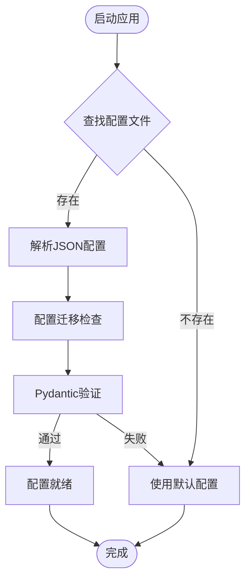
```mermaid
flowchart TD
    Start([启动应用]) --> FindConfig{查找配置文件}

    FindConfig -->|存在| Parse[解析JSON配置]
    FindConfig -->|不存在| Default[使用默认配置]

    Parse --> Migrate[配置迁移检查]
    Migrate --> Validate[Pydantic验证]

    Validate -->|通过| Ready[配置就绪]
    Validate -->|失败| Default

    Ready --> End([完成])

    Default --> End
```

---

## 上下文构建流程

构建发送给 LLM 的完整上下文，包括系统提示、记忆、技能和用户消息。

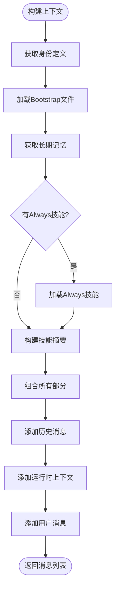
```mermaid
flowchart TD
    Start([构建上下文]) --> Identity[获取身份定义]
    Identity --> Bootstrap[加载Bootstrap文件]
    Bootstrap --> Memory[获取长期记忆]

    Memory --> AlwaysSkills{有Always技能?}
    AlwaysSkills -->|是| LoadAlways[加载Always技能]
    AlwaysSkills -->|否| SkillsSummary

    LoadAlways --> SkillsSummary[构建技能摘要]
    SkillsSummary --> Combine[组合所有部分]

    Combine --> AddHistory[添加历史消息]
    AddHistory --> Runtime[添加运行时上下文]
    Runtime --> UserMsg[添加用户消息]

    UserMsg --> End([返回消息列表])
```

---

## 消息总线流程

异步消息队列解耦渠道与 Agent 核心，支持入站和出站消息传递。

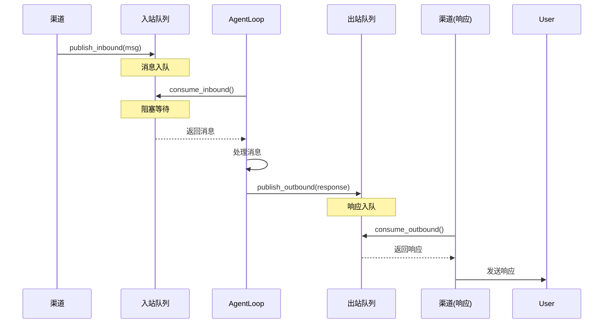
```mermaid
sequenceDiagram
    participant Channel as 渠道
    participant Inbound as 入站队列
    participant Agent as AgentLoop
    participant Outbound as 出站队列
    participant Channel2 as 渠道(响应)

    Channel->>Inbound: publish_inbound(msg)
    Note over Inbound: 消息入队

    Agent->>Inbound: consume_inbound()
    Note over Inbound: 阻塞等待

    Inbound-->>Agent: 返回消息

    Agent->>Agent: 处理消息

    Agent->>Outbound: publish_outbound(response)
    Note over Outbound: 响应入队

    Channel2->>Outbound: consume_outbound()
    Outbound-->>Channel2: 返回响应

    Channel2->>User: 发送响应
```

---

## 会话持久化流程

会话的创建、保存、加载和失效机制。

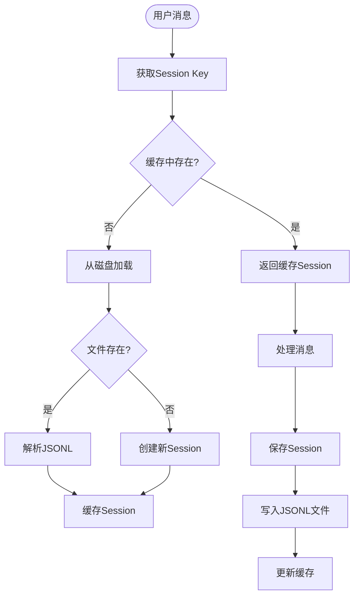
```mermaid
flowchart TD
    Start([用户消息]) --> GetSession[获取Session Key]

    GetSession --> Cache{缓存中存在?}
    Cache -->|是| LoadCache[返回缓存Session]
    Cache -->|否| LoadDisk[从磁盘加载]

    LoadDisk --> Exists{文件存在?}
    Exists -->|是| Parse[解析JSONL]
    Exists -->|否| Create[创建新Session]

    Parse --> CacheResult[缓存Session]
    Create --> CacheResult
    LoadCache --> Process[处理消息]

    Process --> Save[保存Session]
    Save --> Write[写入JSONL文件]
    Write --> UpdateCache[更新缓存]
```

---

## 消息发送流程

Agent 使用 message 工具向用户发送消息的流程。

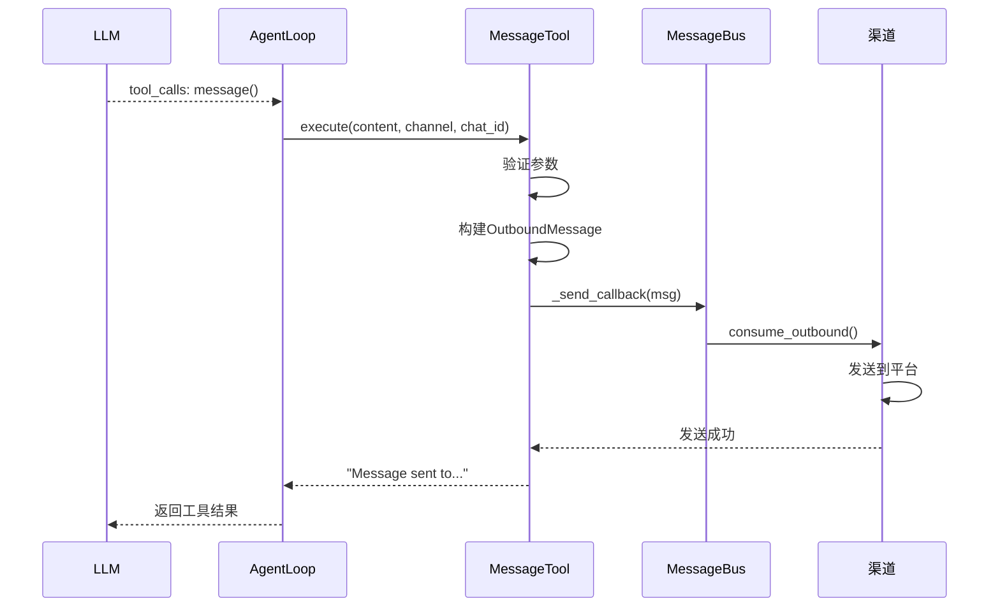
```mermaid
sequenceDiagram
    participant LLM as LLM
    participant Agent as AgentLoop
    participant MT as MessageTool
    participant Bus as MessageBus
    participant Channel as 渠道

    LLM-->>Agent: tool_calls: message()

    Agent->>MT: execute(content, channel, chat_id)

    MT->>MT: 验证参数
    MT->>MT: 构建OutboundMessage

    MT->>Bus: _send_callback(msg)
    Bus->>Channel: consume_outbound()

    Channel->>Channel: 发送到平台

    Channel-->>MT: 发送成功
    MT-->>Agent: "Message sent to..."
    Agent-->>LLM: 返回工具结果
```

---

## 技能加载器流程

技能的扫描、解析、元数据提取和按需加载。

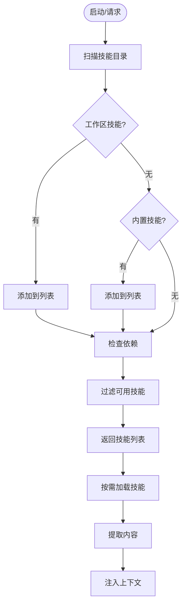
```mermaid
flowchart TD
    Start([启动/请求]) --> Scan[扫描技能目录]

    Scan --> Workspace{工作区技能?}
    Workspace -->|有| AddWS[添加到列表]
    Workspace -->|无| Builtin{内置技能?}

    Builtin -->|有| AddBuiltin[添加到列表]
    Builtin -->|无| CheckReq[检查依赖]

    AddWS --> CheckReq
    AddBuiltin --> CheckReq

    CheckReq --> Filter[过滤可用技能]
    Filter --> List[返回技能列表]

    List --> LoadSkill[按需加载技能]
    LoadSkill --> Extract[提取内容]
    Extract --> Inject[注入上下文]
```

---

## LLM Provider 提供商流程

LLM 提供商的注册、调用和管理流程，支持多提供商切换和故障转移。

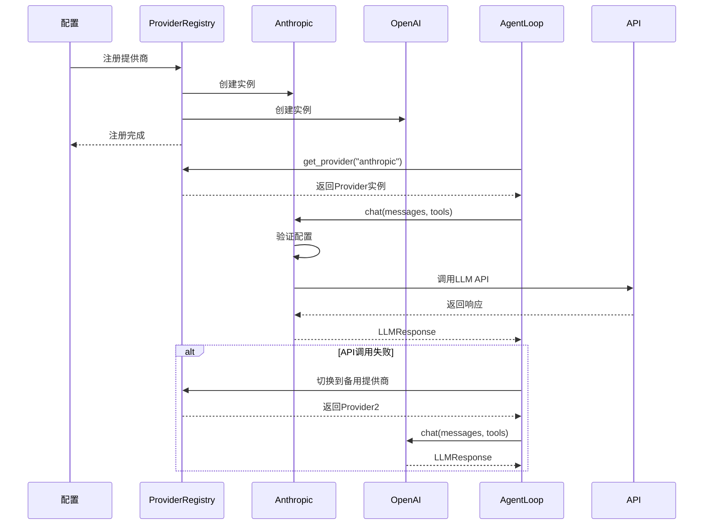
```mermaid
sequenceDiagram
    participant Config as 配置
    participant Registry as ProviderRegistry
    participant Provider1 as Anthropic
    participant Provider2 as OpenAI
    participant Agent as AgentLoop

    Config->>Registry: 注册提供商
    Registry->>Provider1: 创建实例
    Registry->>Provider2: 创建实例
    Registry-->>Config: 注册完成

    Agent->>Registry: get_provider("anthropic")
    Registry-->>Agent: 返回Provider实例

    Agent->>Provider1: chat(messages, tools)
    Provider1->>Provider1: 验证配置
    Provider1->>API: 调用LLM API
    API-->>Provider1: 返回响应
    Provider1-->>Agent: LLMResponse

    alt API调用失败
        Agent->>Registry: 切换到备用提供商
        Registry-->>Agent: 返回Provider2
        Agent->>Provider2: chat(messages, tools)
        Provider2-->>Agent: LLMResponse
    end
```

---

## Skill 技能工作流

技能的加载、解析和注入到 Agent 上下文的完整流程。

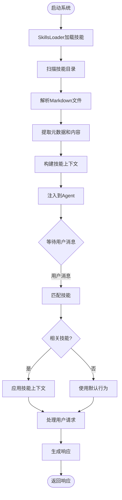
```mermaid
flowchart TD
    Start([启动系统]) --> LoadSkills[SkillsLoader加载技能]

    LoadSkills --> Scan[扫描技能目录]
    Scan --> Parse[解析Markdown文件]
    Parse --> Extract[提取元数据和内容]

    Extract --> BuildContext[构建技能上下文]
    BuildContext --> Inject[注入到Agent]

    Inject --> Wait{等待用户消息}

    Wait -->|用户消息| Match[匹配技能]
    Match --> Relevant{相关技能?}
    Relevant -->|是| Apply[应用技能上下文]
    Relevant -->|否| Default[使用默认行为]

    Apply --> Process[处理用户请求]
    Default --> Process

    Process --> Response[生成响应]
    Response --> End([返回响应])
```

---

## MCP 工具集成

通过 Model Context Protocol (MCP) 集成外部工具和服务，扩展 Agent 能力。

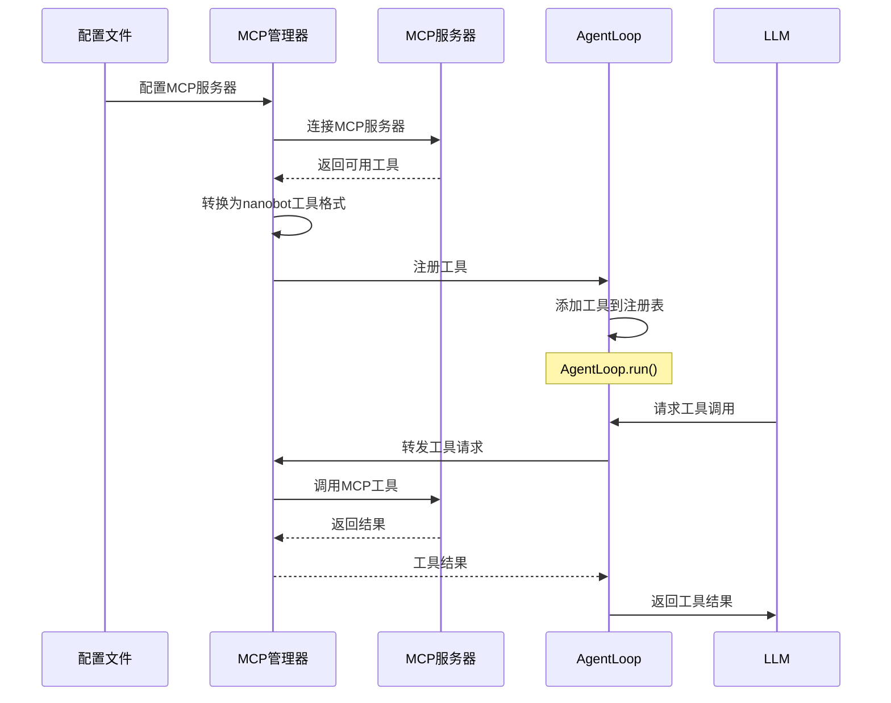
```mermaid
sequenceDiagram
    participant Config as 配置文件
    participant MCP as MCP管理器
    participant Server as MCP服务器
    participant Agent as AgentLoop
    participant LLM as LLM

    Config->>MCP: 配置MCP服务器
    MCP->>Server: 连接MCP服务器

    Server-->>MCP: 返回可用工具
    MCP->>MCP: 转换为nanobot工具格式

    MCP->>Agent: 注册工具
    Agent->>Agent: 添加工具到注册表

    Note over Agent: AgentLoop.run()

    LLM->>Agent: 请求工具调用
    Agent->>MCP: 转发工具请求

    MCP->>Server: 调用MCP工具
    Server-->>MCP: 返回结果

    MCP-->>Agent: 工具结果
    Agent->>LLM: 返回工具结果
```

---

## 工具调用机制

LLM 通过工具调用来执行具体任务，包括工具注册、参数验证、执行和结果返回。

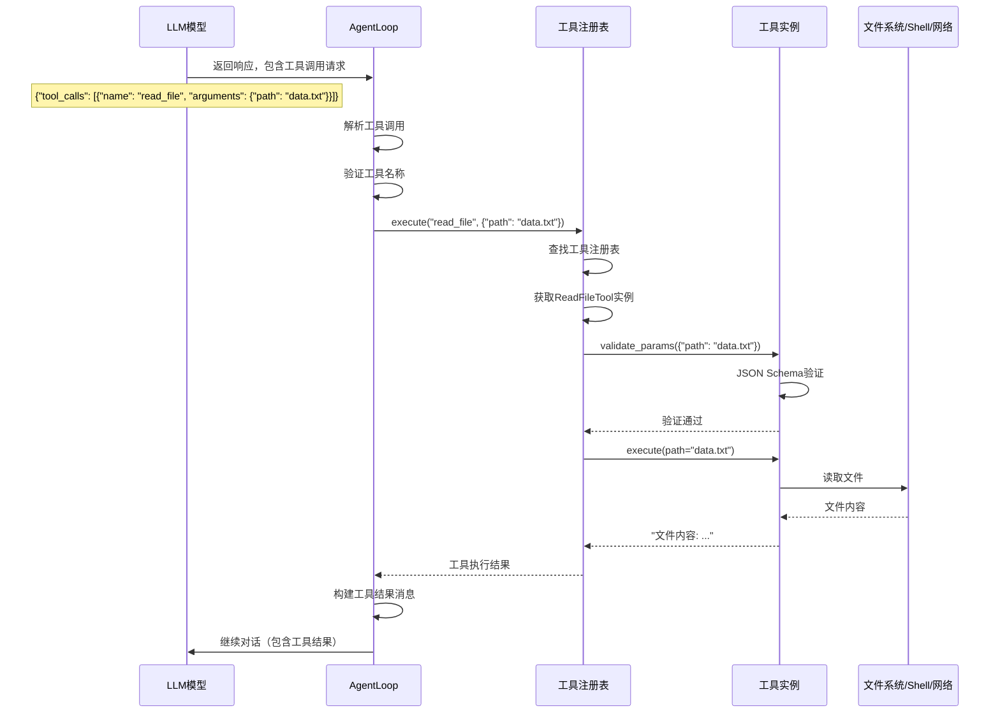
```mermaid
sequenceDiagram
    participant LLM as LLM模型
    participant AL as AgentLoop
    participant TR as 工具注册表
    participant Tool as 工具实例
    participant FS as 文件系统/Shell/网络

    LLM->>AL: 返回响应，包含工具调用请求
    Note over LLM: {"tool_calls": [{"name": "read_file", "arguments": {"path": "data.txt"}}]}

    AL->>AL: 解析工具调用
    AL->>AL: 验证工具名称

    AL->>TR: execute("read_file", {"path": "data.txt"})
    TR->>TR: 查找工具注册表
    TR->>TR: 获取ReadFileTool实例

    TR->>Tool: validate_params({"path": "data.txt"})
    Tool->>Tool: JSON Schema验证
    Tool-->>TR: 验证通过

    TR->>Tool: execute(path="data.txt")
    Tool->>FS: 读取文件
    FS-->>Tool: 文件内容

    Tool-->>TR: "文件内容: ..."
    TR-->>AL: 工具执行结果

    AL->>AL: 构建工具结果消息

    AL->>LLM: 继续对话（包含工具结果）
```

---

## 启动流程

nanobot 系统启动时的完整初始化序列，包括配置加载、组件初始化和服务启动。

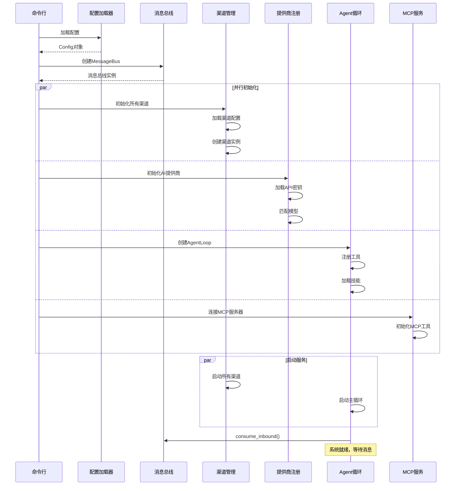
```mermaid
sequenceDiagram
    participant CLI as 命令行
    participant Config as 配置加载器
    participant Bus as 消息总线
    participant Channels as 渠道管理
    participant Provider as 提供商注册
    participant Agent as Agent循环
    participant MCP as MCP服务

    CLI->>Config: 加载配置
    Config-->>CLI: Config对象

    CLI->>Bus: 创建MessageBus
    Bus-->>CLI: 消息总线实例

    par 并行初始化
        CLI->>Channels: 初始化所有渠道
        Channels->>Channels: 加载渠道配置
        Channels->>Channels: 创建渠道实例
    and
        CLI->>Provider: 初始化AI提供商
        Provider->>Provider: 加载API密钥
        Provider->>Provider: 匹配模型
    and
        CLI->>Agent: 创建AgentLoop
        Agent->>Agent: 注册工具
        Agent->>Agent: 加载技能
    and
        CLI->>MCP: 连接MCP服务器
        MCP->>MCP: 初始化MCP工具
    end

    par 启动服务
        Channels->>Channels: 启动所有渠道
        Agent->>Agent: 启动主循环
    end

    Agent->>Bus: consume_inbound()
    Note over Agent: 系统就绪，等待消息
```

---

## 消息处理流程

从接收用户消息到返回响应的完整处理流程，包括会话管理、上下文构建和LLM调用。

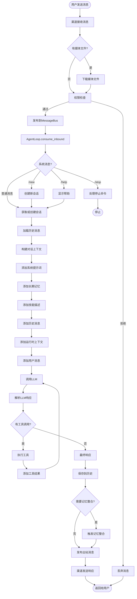
```mermaid
flowchart TD
    Start([用户发送消息]) --> Receive[渠道接收消息]

    Receive --> Download{有媒体文件?}
    Download -->|是| DownloadFiles[下载媒体文件]
    Download -->|否| CheckPermission
    DownloadFiles --> CheckPermission[权限检查]

    CheckPermission -->|通过| PublishToBus[发布到MessageBus]
    CheckPermission -->|拒绝| Drop[丢弃消息]

    PublishToBus --> AgentLoop[AgentLoop.consume_inbound]

    AgentLoop --> CheckSystem{系统消息?}
    CheckSystem -->|/stop| HandleStop[处理停止命令]
    CheckSystem -->|/new| HandleNew[创建新会话]
    CheckSystem -->|/help| HandleHelp[显示帮助]
    CheckSystem -->|普通消息| GetSession

    HandleStop --> End1([停止])
    HandleNew --> GetSession
    HandleHelp --> GetSession

    GetSession[获取或创建会话] --> LoadHistory[加载历史消息]
    LoadHistory --> BuildContext[构建对话上下文]

    BuildContext --> AddSystem[添加系统提示词]
    AddSystem --> AddMemory[添加长期记忆]
    AddMemory --> AddSkills[添加技能描述]
    AddSkills --> AddHistory[添加历史消息]
    AddRuntime --> AddUserMsg[添加用户消息]
    AddHistory --> AddRuntime[添加运行时上下文]
    AddUserMsg --> LLMCall[调用LLM]

    LLMCall --> ParseResponse[解析LLM响应]

    ParseResponse --> CheckTools{有工具调用?}
    CheckTools -->|是| ExecuteTools[执行工具]
    CheckTools -->|否| FinalResponse

    ExecuteTools --> AddToolResults[添加工具结果]
    AddToolResults --> LLMCall

    FinalResponse[最终响应] --> SaveHistory[保存到历史]
    SaveHistory --> CheckMemory{需要记忆整合?}
    CheckMemory -->|是| Consolidate[触发记忆整合]
    CheckMemory -->|否| PublishOutbound
    Consolidate --> PublishOutbound[发布出站消息]

    PublishOutbound --> ChannelSend[渠道发送响应]
    ChannelSend --> End([返回给用户])

    Drop --> End
```

---

## 记忆整合流程

当对话消息数量超过阈值时，自动触发记忆整合，将历史对话提炼为长期记忆。

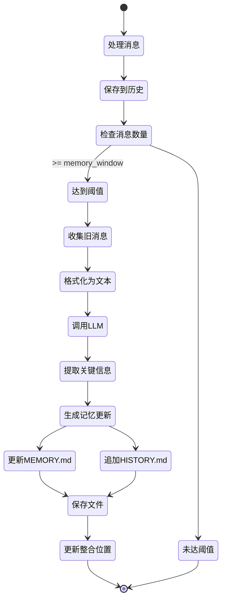
```mermaid
stateDiagram-v2
    [*] --> 处理消息
    处理消息 --> 保存到历史
    保存到历史 --> 检查消息数量
    检查消息数量 --> 未达阈值
    检查消息数量 --> 达到阈值: >= memory_window

    达到阈值 --> 收集旧消息
    收集旧消息 --> 格式化为文本
    格式化为文本 --> 调用LLM
    调用LLM --> 提取关键信息
    提取关键信息 --> 生成记忆更新

    生成记忆更新 --> 更新MEMORY.md
    生成记忆更新 --> 追加HISTORY.md

    更新MEMORY.md --> 保存文件
    追加HISTORY.md --> 保存文件
    保存文件 --> 更新整合位置
    更新整合位置 --> [*]
    未达阈值 --> [*]
```

---

## Cron 定时任务流程

基于 Cron 表达式或固定间隔的定时任务执行，支持一次性任务和循环任务。

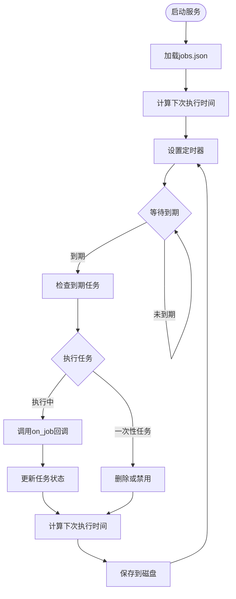
```mermaid
flowchart TD
    Start([启动服务]) --> LoadJobs[加载jobs.json]
    LoadJobs --> Compute[计算下次执行时间]
    Compute --> ArmTimer[设置定时器]

    ArmTimer --> Wait{等待到期}
    Wait -->|到期| CheckJobs[检查到期任务]
    Wait -->|未到期| Wait

    CheckJobs --> Execute{执行任务}
    Execute -->|执行中| RunJob[调用on_job回调]
    RunJob --> UpdateState[更新任务状态]
    UpdateState --> ComputeNext[计算下次执行时间]

    Execute -->|一次性任务| DeleteOrDisable[删除或禁用]
    DeleteOrDisable --> ComputeNext

    ComputeNext --> Save[保存到磁盘]
    Save --> ArmTimer
```

---

## Heartbeat 心跳服务

周期性唤醒代理检查任务，通过 LLM 决策是否需要执行任务。

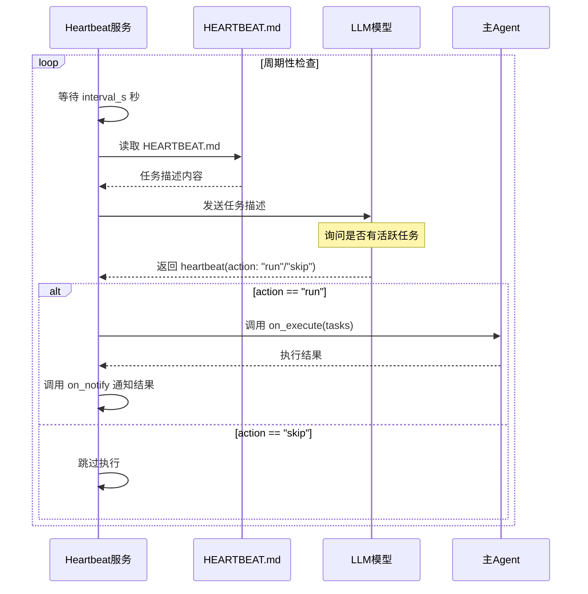
```mermaid
sequenceDiagram
    participant HS as Heartbeat服务
    participant File as HEARTBEAT.md
    participant LLM as LLM模型
    participant Agent as 主Agent

    loop 周期性检查
        HS->>HS: 等待 interval_s 秒

        HS->>File: 读取 HEARTBEAT.md
        File-->>HS: 任务描述内容

        HS->>LLM: 发送任务描述
        Note over LLM: 询问是否有活跃任务

        LLM-->>HS: 返回 heartbeat(action: "run"/"skip")

        alt action == "run"
            HS->>Agent: 调用 on_execute(tasks)
            Agent-->>HS: 执行结果
            HS->>HS: 调用 on_notify 通知结果
        else action == "skip"
            HS->>HS: 跳过执行
        end
    end
```

---

## 子代理执行流程

在后台启动子代理执行复杂任务，完成后通知主代理，支持并发和任务取消。

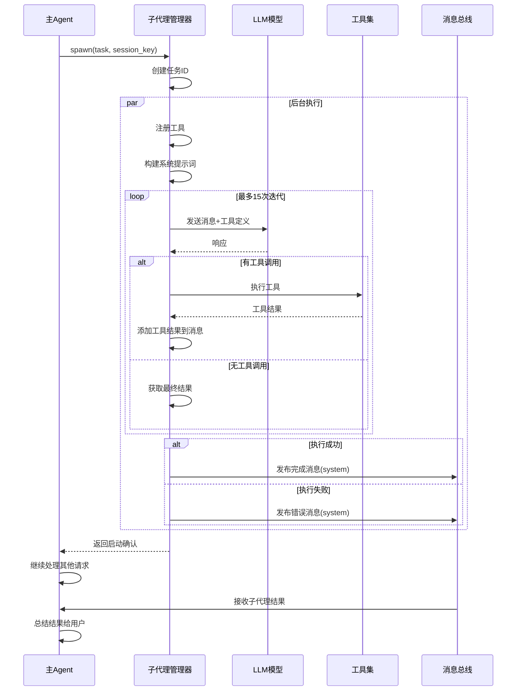
```mermaid
sequenceDiagram
    participant Main as 主Agent
    participant SAM as 子代理管理器
    participant LLM as LLM模型
    participant Tools as 工具集
    participant Bus as 消息总线

    Main->>SAM: spawn(task, session_key)
    SAM->>SAM: 创建任务ID

    par 后台执行
        SAM->>SAM: 注册工具
        SAM->>SAM: 构建系统提示词

        loop 最多15次迭代
            SAM->>LLM: 发送消息+工具定义
            LLM-->>SAM: 响应

            alt 有工具调用
                SAM->>Tools: 执行工具
                Tools-->>SAM: 工具结果
                SAM->>SAM: 添加工具结果到消息
            else 无工具调用
                SAM->>SAM: 获取最终结果
            end
        end

        alt 执行成功
            SAM->>Bus: 发布完成消息(system)
        else 执行失败
            SAM->>Bus: 发布错误消息(system)
        end
    end

    SAM-->>Main: 返回启动确认

    Main->>Main: 继续处理其他请求

    Bus->>Main: 接收子代理结果
    Main->>Main: 总结结果给用户
```

---

## 错误处理机制

分层错误处理策略，包括工具执行错误、LLM API错误、权限错误和超时错误。

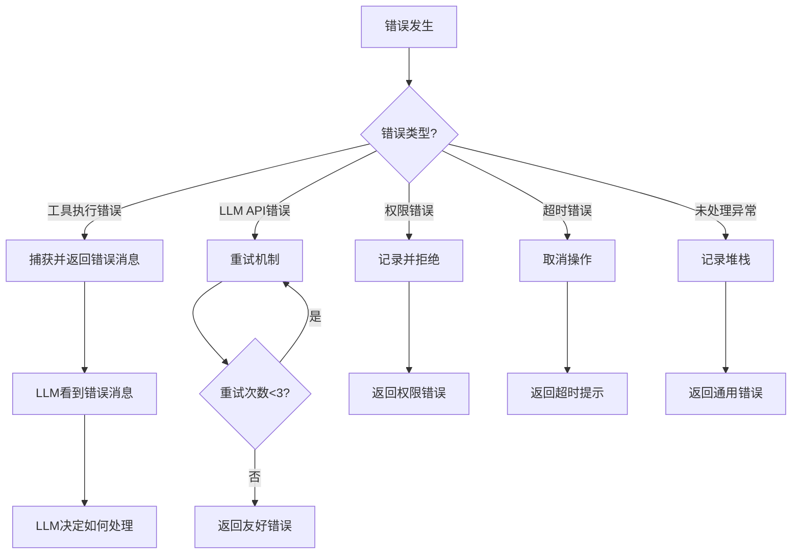
```mermaid
flowchart TD
    A[错误发生] --> B{错误类型?}

    B -->|工具执行错误| C[捕获并返回错误消息]
    C --> D[LLM看到错误消息]
    D --> E[LLM决定如何处理]

    B -->|LLM API错误| F[重试机制]
    F --> G{重试次数<3?}
    G -->|是| F
    G -->|否| H[返回友好错误]

    B -->|权限错误| I[记录并拒绝]
    I --> J[返回权限错误]

    B -->|超时错误| K[取消操作]
    K --> L[返回超时提示]

    B -->|未处理异常| M[记录堆栈]
    M --> N[返回通用错误]
```

---

## Channel 渠道工作流

消息从各平台渠道到 Agent 的完整传递过程，包括消息接收、处理和响应返回。

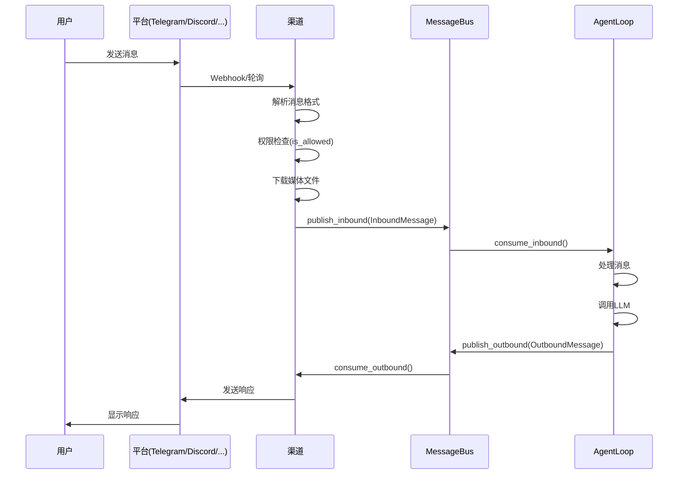
```mermaid
sequenceDiagram
    participant User as 用户
    participant Platform as 平台(Telegram/Discord/...)
    participant Channel as 渠道
    participant Bus as MessageBus
    participant Agent as AgentLoop

    User->>Platform: 发送消息
    Platform->>Channel: Webhook/轮询

    Channel->>Channel: 解析消息格式
    Channel->>Channel: 权限检查(is_allowed)
    Channel->>Channel: 下载媒体文件

    Channel->>Bus: publish_inbound(InboundMessage)
    Bus->>Agent: consume_inbound()

    Agent->>Agent: 处理消息
    Agent->>Agent: 调用LLM

    Agent->>Bus: publish_outbound(OutboundMessage)
    Bus->>Channel: consume_outbound()

    Channel->>Platform: 发送响应
    Platform->>User: 显示响应
```

---

## Session 会话管理

会话创建、历史管理和持久化，确保对话上下文的连续性。

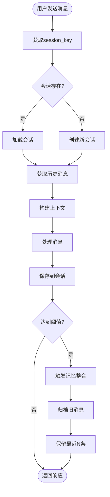
```mermaid
flowchart TD
    Start([用户发送消息]) --> GetKey[获取session_key]

    GetKey --> Find{会话存在?}
    Find -->|是| Load[加载会话]
    Find -->|否| Create[创建新会话]

    Load --> History[获取历史消息]
    Create --> History

    History --> Build[构建上下文]
    Build --> Process[处理消息]
    Process --> Save[保存到会话]

    Save --> Check{达到阈值?}
    Check -->|是| Consolidate[触发记忆整合]
    Check -->|否| End([返回响应])

    Consolidate --> Archive[归档旧消息]
    Archive --> Keep[保留最近N条]
    Keep --> End
```

---

## 并发消息处理

支持多个用户同时对话，同一用户的请求串行执行，不同用户可以并行处理。

```mermaid
sequenceDiagram
    participant Bus as MessageBus
    participant Loop as AgentLoop
    participant SessionA as 会话A
    participant SessionB as 会话B
    participant LLM as LLM

    Bus->>Loop: 消息1 (session A)
    Loop->>Loop: create_task(_dispatch(msg1))
    Loop->>Loop: 获取session A锁

    Bus->>Loop: 消息2 (session B)
    Loop->>Loop: create_task(_dispatch(msg2))

    Bus->>Loop: 消息3 (session A)
    Loop->>Loop: create_task(_dispatch(msg3))

    par 并行处理不同会话
        Loop->>LLM: 处理session B
        LLM-->>Loop: 响应B
        Loop->>Bus: 发布响应B
    and
        Loop->>LLM: 处理session A (等待锁)
        LLM-->>Loop: 响应A1
        Loop->>Bus: 发布响应A1
    end

    Loop->>Loop: session A锁释放

    Loop->>Loop: 继续处理session A消息3
    Loop->>LLM: 处理session A
    LLM-->>Loop: 响应A2
    Loop->>Bus: 发布响应A2
```

---

## 核心流程总结

| 模块 | 描述 |
|------|------|
| **Provider** | LLM提供商注册、调用和多提供商切换与故障转移 |
| **MCP** | 通过 Model Context Protocol 连接外部工具和服务 |
| **启动流程** | 并行初始化配置、消息总线、渠道、提供商、Agent循环 |
| **渠道** | 多平台消息接收：Telegram、Discord、WhatsApp、Slack 等 |
| **技能** | 技能加载、解析、匹配和注入到Agent上下文 |
| **会话管理** | 会话创建、历史加载、持久化和自动记忆整合 |
| **配置** | 配置文件解析、验证和迁移流程 |
| **消息总线** | 异步队列解耦渠道与Agent，入站/出站消息传递 |
| **上下文构建** | 系统提示、记忆、技能、历史和运行时上下文组合 |
| **技能加载** | 技能扫描、解析，元数据提取和按需加载 |
| **会话持久化** | 会话创建，保存、加载和缓存机制 |
| **消息发送** | Agent通过message工具发送消息到用户 |
| **并发** | 多用户并行，同一用户请求串行，Session 锁机制 |
| **消息处理** | 7步处理：权限→会话→上下文→LLM→工具→保存→响应 |
| **工具调用** | 验证参数 → 执行工具 → 返回结果给LLM → 循环直到完成 |
| **记忆整合** | 达到阈值时触发，LLM提取关键信息更新MEMORY.md |
| **Cron任务** | 基于Cron表达式或固定间隔执行，支持一次性/循环任务 |
| **Heartbeat** | 周期性检查HEARTBEAT.md，LLM决策是否执行任务 |
| **子代理** | 后台执行复杂任务，最多15次迭代，完成后通知主Agent |
| **错误处理** | 分层处理：工具错误→API错误→权限错误→超时→通用 |

---

*Nanobot AI Agent 框架 - 核心工作流程文档*
